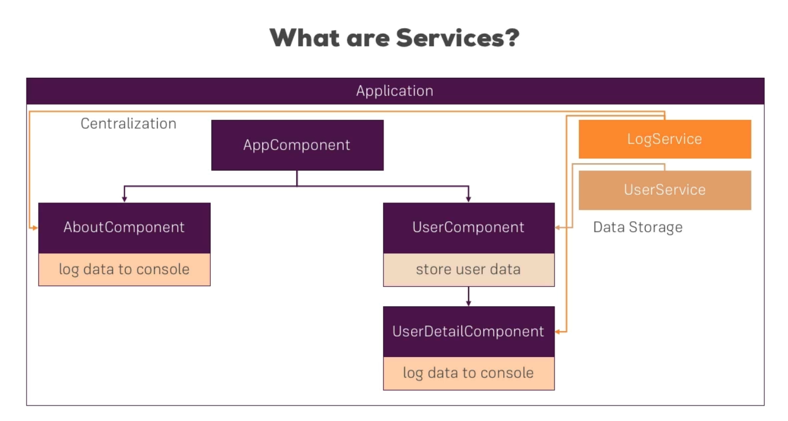
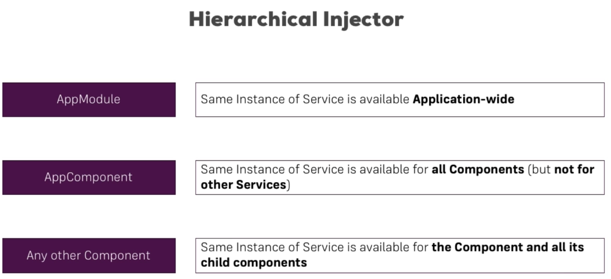
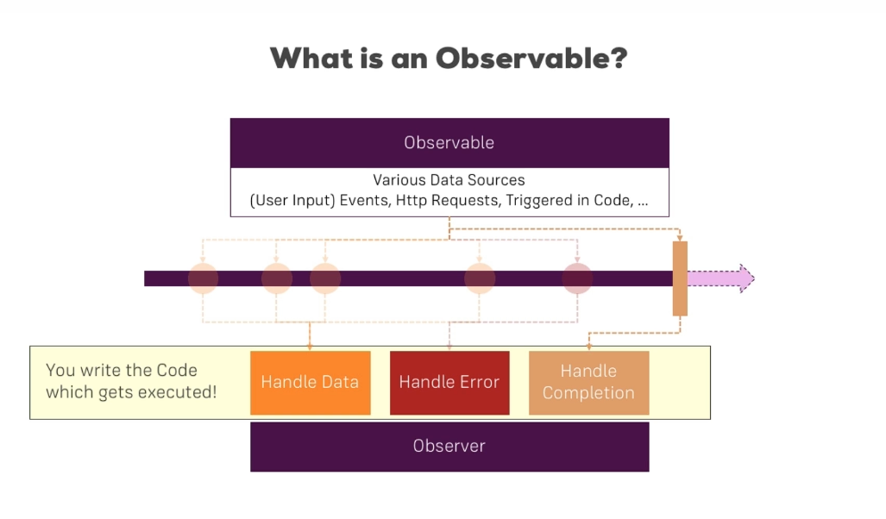
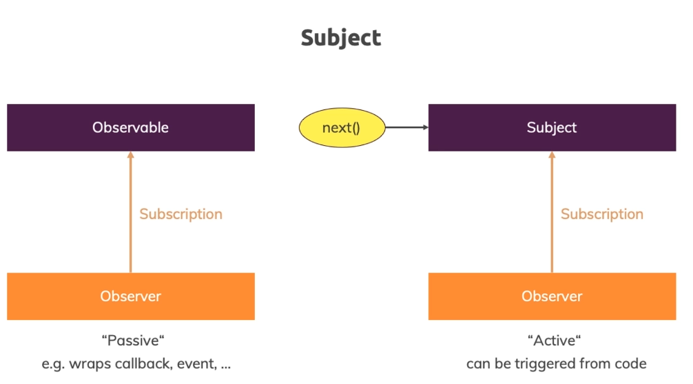

# Angular Notes (Udemy)

<br>

<nav>

## Navigation <span id="nav"></span>

### <a href="#top01">**Section 01: Getting Started**</a>

### <a href="#top02">**Section 02: The basics**</a>

### <a href="#top03">**Section 03: The Course Project - The Basics**</a>

### <a href="#top04">**Section 04: Debugging**</a>

### <a href="#top05">**Section 05: Components & Databinding Deep Dive**</a>

### <a href="#top06">**Section 06: Course Project - Components & Databinding**</a>

### <a href="#top07">**Section 07: Directives Deep Dive**</a>

### <a href="#top08">**Section 08: Course Project - Directives**</a>

### <a href="#top09">**Section 09: Using Services & Dependency Injection**</a>

### <a href="#top10">**Section 10: Course Project - Services & Dependency Injection**</a>

### <a href="#top11">**Section 11: Changing Pages with Routing**</a>

### <a href="#top12">**Section 12: Course Project - Routing**</a>

### <a href="#top13">**Section 13: Observables**</a>

### <a href="#top14">**Section-14: Course Project - Observables**</a>

</nav>

<br><br>

<hr>

<br><br>

## **Section 01: Getting Started** <a href="#nav">&#8593;</a> <span id="top01"></span>

<br><br>

1. <a href="#a0100">What is Angular?</a>
2. <a href="#a0101">Project Setup and First App</a>
3. <a href="#a0102">The Course Structure</a>
4. <a href="#a0103">A Basic Project Setup using Bootstrap for Styling</a>

<br><br>

### **What is Angular?** <span id="a0100"></span><a href="#top01">&#8593;</a>

<br>

Angular is a JavaScript Framework which allows you to create reactive Single-Page-Applications (SPAs).

<br><br>

### **Project Setup and First App** <span id="a0101"></span><a href="#top01">&#8593;</a>

<br>

Angular CLI <a href="https://github.com/angular/angular-cli">Documentation</a>

<br>

Angular Dependencies - dependencies are things like the Angular framework itself, but also some other libraries that framework uses.

<br>

- Install NodeJS: https://nodejs.org/en/
- Install Angular CLI:
  - `npm install -g @angular/cli@latest`

<br>

In the app.module.ts you specify which "pieces" belong to our app. Import FormsModule:

```ts
import { FormsModule } from "@angular/forms";

// ...

imports: [BrowserModule, FormsModule];
```

<br><br>

<hr>

<br><br>

## **Section 02: The basics** <a href="#nav">&#8593;</a> <span id="top02"></span>

<br><br>

1. <a href="#a0200">How an Angular App gets Loaded and Started</a>
2. <a href="#a0201">Components are Important!</a>
3. <a href="#a0202">Creating a New Component</a>
4. <a href="#a0203">Understanding the Role of AppModule and Component Declaration</a>
5. <a href="#a0204">Creating Components with the CLI & Nesting Components</a>
6. <a href="#a0205">Working with Component Templates</a>
7. <a href="#a0206">Working with Component Styles</a>
8. <a href="#a0207">Fully Understanding the Component Selector</a>
9. <a href="#a0208">What is Databinding?</a>
10. <a href="#a0209">String Interpolation</a>
11. <a href="#a0210">Property Binding</a>
12. <a href="#a0211">Property Binding vs String Interpolation</a>
13. <a href="#a0212">Event Binding</a>
14. <a href="#a0213">Passing and Using Data with Event Binding</a>
15. <a href="#a0214">Two-Way-Databinding</a>
16. <a href="#a0215">Combining all Forms of Databinding</a>
17. <a href="#a0216">Understanding Directives</a>
18. <a href="#a0217">Using ngIf to Output Data Conditionally & Enhancing ngIf with an Else Condition</a>
19. <a href="#a0218">Styling Elements Dynamically with ngStyle & Applying CSS Classes Dynamically with ngClass</a>
20. <a href="#a0219">Outputting Lists with ngFor</a>
21. <a href="#a0220">Getting the Index when using ngFor</a>

<br><br>

### **How an Angular App gets Loaded and Started** <span id="a0200"></span><a href="#top02">&#8593;</a>

<br>

`Index.html` file contains `script` files which are being executed, which starts the Angular app.

<br>

In the `app.module.ts` file, in the `bootstrap` array you specify the bootstrapping (root) component.

<br><br>

### **The Course Structure** <span id="a0102"></span><a href="#top01">&#8593;</a>

- Getting Started
- The Basics
- Components & Data binding
- Directives
- Services & Dependency Injection
- Routing
- Observables
- Forms
- Pipes
- Http
- Authentication
- Optimizations & NgModules
- Deployment of an App
- Animations & Testing

<br><br>

### **A Basic Project Setup using Bootstrap for Styling** <span id="a0103"></span><a href="#top01">&#8593;</a>

<br>

install Bootstrap: `npm install --save bootstrap@3`

<br>

add Bootstrap css styles (`angular.json`):

```json
{
  "styles": [
    "node_modules/bootstrap/dist/css/bootstrap.min.css",
    "src/styles.css"
  ]
}
```

<br><br>

### **Components are Important!** <span id="a0201"></span><a href="#top02">&#8593;</a>

<br>

Keep in mind that Angular is a JS framework, which changes the DOM at runtime.

<br>

Components are a key feature in Angular. You build your whole application by composing it from a couple of components.

<br>

We start with the app.component - the root component which holds our entire application in the end. This root component will be the component where we later nest or add our other components to the template (html file).

<br><br>

### **Creating a New Component** <span id="a0202"></span><a href="#top02">&#8593;</a>

<br>

Component is simply a TypeScript class, so then Angular is able to instantiate it to create objects based on the blueprint we set up.

<br>

Create a new Component:

- Create a new directory in app directory
- in the server directory (or any other), create class component:
  - `server.component.ts`

```ts
import { Component } from "@angular/core";

@Component({
  // selector - html selector ( <app-server></app-server> )
  selector: "app-server",
  // template url - component's html file
  templateUrl: "./server.component.html",
})
export class ServerComponent {}
```

<br><br>

### **Understanding the Role of AppModule and Component Declaration** <span id="a0203"></span><a href="#top02">&#8593;</a>

<br>

Now to use our new component, we need to add something in the `app.module.ts`.

- Angular uses components to build web pages and uses `modules` to basically bundle different pieces, for example components of your app into package list
- Angular Module is a bundle of funcionality of our app, and it basically gives Angular the information which features does my app have and use.
- Angular Module file (`app.module.ts`) is decorated by a `@NgModule` decorator which is imported from `'@angular/core'`
  - When you create a new component, you have to register it in app.module.ts, in the `@NgModule`.
    - In Angular Module we have 4 properties:
      - `declarations`: (here you register new components, besides declaring, you also have to `import` a component)
      - `imports`: (allows us to add other modules to this module)
      - `providers`: (services)
      - `bootstrap`: (declare the bootstrapping component (root component))

<br>

Add custom component to app.component.html template: `<app-server></app-server>`

<br><br>

### **Creating Components with the CLI & Nesting Components** <span id="a0204"></span><a href="#top02">&#8593;</a>

<br>

Creating a new component which is nested into another component:

- `ng generate component servers`
- or `ng g c servers`
  - it will generate 4 files:
    - component class file
    - component template file
    - component styling (CSS/SCSS/SASS etc.) file
    - component testing file (`.spec.ts`)
- make sure the new component has been added to `app.module.ts` in the declarations array.
- you can nest components into each other, e.g. `servers` component having the `server` component (selector) inside of its template.
- you can replicate components by simply using them multiple times (using their selectors).

<br><br>

### **Working with Component Templates** <span id="a0205"></span><a href="#top02">&#8593;</a>

<br>

Instead of using external template (html file), you can also use inline template - you define html code in the TypeScript code (as a value of `template` property).

<br>

You use it like this:

```ts
@Component({
  selector: 'app-servers',
  // template prop instead of templateUrl
  template: `
    <app-server></app-server>
    <app-server></app-server>
  `,
  styleUrls: ['./servers.component.css'],
})
```

<br>

It is okay to use this approach when you have not so much code in your template, but if you have more than let's say 3 lines of code, using an external template file is easier to follow/understand. You just should know that it is possible.

<br><br>

### **Working with Component Styles** <span id="a0206"></span><a href="#top02">&#8593;</a>

<br>

- To define styling for a component, go to (any component, here root component) the app.`component.ts`
- Here you can point to external stylesheets:
  - `styleUrls: ['./app.component.css', './another.css']`,
- You can also use inline styling - in the class file - app.`component.ts`:

```ts
styles: [`
    h3 {
      color: dodgerBlue;
    }
  `],
```

It's good to use if you have a small component with little styling. Otherwise use external css file.

<br><br>

### **Fully Understanding the Component Selector** <span id="a0207"></span><a href="#top02">&#8593;</a>

<br>

- The `selector`'s value has to be unique
- The `selector` works like the CSS selector, and therefore you're not limited to selecting by element

<br>

#### Select by attribute:

<br>

```ts
// servers.component.ts
// changing it into an attribute, not a tag:
selector: "[app-servers]";
```

```html
<!-- servers.component.html -->
<!-- instead of <app-servers></app-servers> -->
<div app-servers></div>
```

<br>

#### Select by class:

<br>

```ts
// servers.component.ts
selector: ".app-servers";
```

```html
<!-- servers.component.html -->
<div class="app-servers"></div>
```

- Selecting by `id` or `pseudo-selectors` (e.g. `:hover`) won't work.

<br><br>

```
Business Logic - In computer software, business logic or domain logic is the part of the program that encodes the real-world business rules that determine how data can be created, stored, and changed.
```

<br><br>

### **What is Databinding?** <span id="a0208"></span><a href="#top02">&#8593;</a>

<br>

Databinding = Communication

<br>

Databinding is communication between your TypeScript code of your component (business logic) and the template (what the uses sees).

<br>

There are different ways of communication, for example:

#### **Output Data (Typescript Code -> Template (HTML))**

We want to **Output Data** from our TypeScript code to the HTML code (template),
we then can use:

- **String Interpolation** ( `{{ data }}` )
- **Property Binding** ( `[property]="data"` )

<br>

#### **React to (User) Events**

- **Event Binding** ( `(event)="expression"` )
  - e.g. a `(click)` event

<br>

#### **Combination of Both**

- **Two-Way-Binding** ( `[(ngModel)]="data"` )
  - we are able to react to events and output something at the same time

<br><br>

### **String Interpolation** <span id="a0209"></span><a href="#top02">&#8593;</a>

<br>

**String Interpolation** ( `{{ data }}` ) must return a string OR something that can be converted into a string

<br>

```html
<p>{{ "Server" }} with ID {{ serverId }} is {{ getServerStatus() }}</p>
```

<br><br>

### **Property Binding** <span id="a0210"></span><a href="#top02">&#8593;</a>

<br>

```html
<button class="btn btn-primary" [disabled]="!allowNewServer">Add Server</button>
```

```ts
export class ServersComponent implements OnInit {
  allowNewServer = false;

  constructor() {
    setTimeout(() => {
      this.allowNewServer = true;
    }, 2000);
  }

  ngOnInit(): void {}
}
```

Besides pointing to HTML element properties, you can also bind to other properties, for example of `directives` and your own `components`.

<br><br>

### **Property Binding vs String Interpolation** <span id="a0211"></span><a href="#top02">&#8593;</a>

<br>

You can output the current value of `allowNewServer` - a boolean:

```html
<p>{{ allowNewServer }}</p>
```

You could also bind the property of `<p>` element to `innerText` property:

```html
<p [innerText]="allowNewServer"></p>
```

<br>

So in this case we could easily replace `String Interpolation` with `Property Binding`.

<br>

When should you use which of the two?

- Use `String Interpolation` ( `{{ data }}` ) when...
  - you want to output something in your template, print some text to it
- Use `Property Binding` ( `[property]="data"` ) when...
  - you want to change some property be it of `HTML Element`, of a `Directive`, or a `Component`

**Note**: Don't mix `Property Binding` and `String Interpolation`.

<br>

Between the quotation marks of property binding, you write TypeScript code/expression, which will return the value this property expects.

<br>

The `Property Binding` expression ( `[property]="data"` ) is not a HTML attribute, but an Angular expression.

<br><br>

### **Event Binding** <span id="a0212"></span><a href="#top02">&#8593;</a>

<br>

Event Binding ( `(event)="expression"` ):

<br>

```html
<button
  class="btn btn-primary"
  [disabled]="!allowNewServer"
  (click)="onCreateServer()"
>
  Add Server
</button>
```

<br>

You can bind any event, for example `(keydown)="TypeScriptExpression"`, it works the same as JavaScript's `onkeydown="..."`.

<br><br>

### **Passing and Using Data with Event Binding** <span id="a0213"></span><a href="#top02">&#8593;</a>

<br>

`$event` - A reserved variable name you can use in a template when using `Event Binding`. Only inside of particular element, the `$event` will be the data emitted by that event (e.g. `(click)` event).

<br>

Passing `$event` as an argument:

```html
<input type="text" class="form-control" (input)="onUpdateServerName($event)" />
```

<br>

With `$event` passed as an argument to the event we're calling, we can capture `(input)` data, or use it anywhere between these quotation marks in the code we're executing.

<br>

`$event` - reserved variable which gives us access to event data.

<br>

```ts
onUpdateServerName(event: Event) {
  // console.log(event);
  this.serverName = (<HTMLInputElement>event.target).value;
}
```

```html
<input type="text" class="form-control" (input)="onUpdateServerName($event)" />
<p>{{ serverName }}</p>
```

<br><br>

### **Two-Way-Databinding** <span id="a0214"></span><a href="#top02">&#8593;</a>

<br>

**Note**: FormsModule is Required for Two-Way-Binding (add it into `imports[]` array).

<br>

Two-Way-Databinding - a nice and easy way of reacting to events in both directions

<br>

Another way of getting event data - Two-Way-Databinding:

```html
<input type="text" class="form-control" [(ngModel)]="serverName" />
```

<br>

This setup will do the following:

- It will trigger on the `(input)` event and update the value of `serverName` in our component automatically
- On the other hand, it will also update the value of input element if we change `serverName` somewhere else

<br><br>

### **Combining all Forms of Databinding** <span id="a0215"></span><a href="#top02">&#8593;</a>

<br>

```html
<label>Server Name</label>
<input type="text" class="form-control" [(ngModel)]="serverName" />
<button
  class="btn btn-primary"
  [disabled]="!allowNewServer"
  (click)="onCreateServer()"
>
  Add Server
</button>
<p>{{ serverCreationStatus }}</p>
```

```ts
export class ServersComponent implements OnInit {
  allowNewServer = false;
  serverCreationStatus = "No server was created!";
  serverName = "";

  constructor() {
    setTimeout(() => {
      this.allowNewServer = true;
    }, 2000);
  }

  ngOnInit(): void {}

  onCreateServer() {
    this.serverCreationStatus =
      "Server was created! Name is " + this.serverName;
  }

  // onUpdateServerName(event: Event) {
  //   this.serverName = (<HTMLInputElement>event.target).value;
  // }
}
```

<br>

With that we're using all four ways of `Databinding` together with each other:

- `Event Binding` ( `(click)="onCreateServer()"` ) to listen to a click event,
- `String Interpolation` ( `<p>{{ serverCreationStatus }}</p>` ) to output the data here,
- `Property Binding` to enable the button ( `[disabled]="!allowNewServer"` ) after 2 seconds,
- and Two-Way-Binding ( `[(ngModel)]="serverName"` ) to fetch our data.

<br><br>

Assignment 2 code:

```html
<input type="text" [(ngModel)]="userName" />
<p>{{ userName }}</p>
<button [disabled]="!userName" (click)="onReset()">Reset</button>
<!-- <button [disabled]="userName === ''" (click)="userName = ''">Reset</button> -->
```

<br><br>

### **Understanding Directives** <span id="a0216"></span><a href="#top02">&#8593;</a>

<br>

Directives are Instructions in the DOM. Components are kind of such instructions in the DOM, when we place the selector of our component, at this point of time we're instructing Angular to add the content of our component template and ts code (business logic) in this place where we use the selector.

<br>

Components are directives with a template. There are also directives without a template:

<br>

An example would be the `appTurnGreen` directive: `<p appTurnGreen>Receives a green background!</p>`, which would be a custom directive we could build. We typically add directives with attribute selector, but technically the selector of the directive can be configured just like the selector of a component (e.g. tag, class, attribute).

<br>

So then Angular would find this instruction, and apply it to the element that has this selector:

```ts
@Directive({
  selector: "[appTurnGreen]",
})
export class TurnGreenDirective {
  // ...logic
}
```

<br><br><br>

### **Using ngIf to Output Data Conditionally & Enhancing ngIf with an Else Condition** <span id="a0217"></span><a href="#top02">&#8593;</a>

<br>

> #### **Using ngIf to Output Data Conditionally**

<br>

The `*ngIf` directive is displaying an element conditionally.

<br>

The `*ngIf` directive is a structural directive - it changes the structure of our DOM, it either adds an element or it doesn't add it.

<br>

The `*ngIf` directive:

```html
<p *ngIf="serverCreated">Server was created, server name is {{ serverName }}</p>
```

```ts
// ...
serverCreated = false;

// ...

onCreateServer() {
    this.serverCreated = true;
}
```

Keep in mind that between the quotation marks you could also do a method call or place a TypeScript expression, anything which returns `true` or `false`.

<br>

Note: Remember that `*ngIf` directive is either adding or removing elements conditionally in the DOM, it doesn't hide them or something, the element is just not there.

<br><br>

> #### **Enhancing ngIf with an Else Condition**

<br>

```html
<p *ngIf="serverCreated; else noServer">
  Server was created, server name is {{ serverName }}
</p>
<ng-template #noServer>
  <p>No server was created!</p>
</ng-template>
```

`<ng-template>` is a component/directive shipped with Angular which you can use to mark places in the DOM.

<br>

`#noServer` - a local reference, a "marker" - with which you mark a certain spot in the template which we want to show conditionally

<br>

`*ngIf="serverCreated; else noServer"` - a `*ngIf` directive with else statement.

<br><br><br>

### **Styling Elements Dynamically with ngStyle & Applying CSS Classes Dynamically with ngClass** <span id="a0218"></span><a href="#top02">&#8593;</a>

<br><br>

> #### **Styling Elements Dynamically with ngStyle**

<br>

A different kind of directives - the `attribute directives`. Attribute directives don't add or remove elements, they only change the element they were placed on.

<br>

Here we are using `attribute directives` with `property binding`:

<br>

```html
<p [ngStyle]="{}">{{ data }}</p>
```

Note: The square brackets are not part of the directive name, the directive name is just `ngStyle`. The square brackets indicate that we want to bind to some property on this directive and this property name happens to also be `ngStyle`.

<br>

The `ngStyle` property expects to get a JavaScript Object, and here you can find the key/value pairs of the `style`. The `style` key is the name of a `style` and the value is the value of a `style` (e.g. `{ 'background-color': 'white' }`)

<br>

There are two notations:

- `'string-dashed-key': 'value'`:

```html
<p [ngStyle]="{ 'background-color': 'red' }">{{ data }}</p>
```

- `camelCasedKey: 'value'`:

```html
<p [ngStyle]="{ backgroundColor: 'red' }">{{ data }}</p>
```

<br>

You could also call a method in the place of `value`:

```html
<p [ngStyle]="{ backgroundColor: getColor() }">{{ data }}</p>
```

```ts
getColor() {
  return this.serverStatus === 'online' ? 'green' : 'red';
}
```

<br>

Note: Remember that between the quotation marks you can write TypeScript code/expression (e.g. `[ngStyle]="{ backgroundColor: x > 5 ? 'blue' : 'white' }"`)

<br><br>

> #### **Applying CSS Classes Dynamically with ngClass**

<br>

`ngClass` directive allows us to dynamically add or remove `CSS classes`

<br>

In this case the `directive` also accepts a JavaScript Object, and we also have `key`/`value` pairs. Here the key is the `CSS class` name and the `value` is the conditions determining whether this class should be attached or not.

<br>

As with `ngStyle`, there are two ways of notation: a `'dashed-string'` or a `camelCased` key with `'string'` value.

<br>

```html
<p
  [ngStyle]="{ backgroundColor: getColor() }"
  [ngClass]="{ online: serverStatus === 'online' }"
>
  {{ "Server" }} with ID {{ serverId }} is {{ getServerStatus() }}
</p>
```

<br><br>

### **Outputting Lists with ngFor** <span id="a0219"></span><a href="#top02">&#8593;</a>

<br>

`*ngFor` is a structural directive (changing the DOM itself)

<br>

```ts
// ...
// Create an Array of servers
servers = ['TestServer', 'TestServer 2'];

// ...

onCreateServer() {
  this.serverCreated = true;
  // push a new server on event call (click)
  this.servers.push(this.serverName);
}
// ...
```

<br>

```html
<app-server *ngFor="let server of servers"></app-server>
```

The syntax: a temporary variable (`let variableName`), then `of` `property` - property we defined in the TypeScript file.

<br>

This will now loop through all the elements of this array and assign individual value to this dynamic (`server`) variable. Just like JavaScript for..of loop.

<br><br>

#### Assignment-3 Code:

```html
<div>
  <!--<button class="btn btn-primary" (click)="showSecret = !showSecret">Display Details</button>-->
  <button (click)="toggle()">Display Details</button>
  <p *ngIf="showSecret">Secret Password = thunderStorm</p>
  <div
    *ngFor="let logItem of log"
    [ngStyle]="{ backgroundColor: logItem >= 5 ? 'blue' : 'transparent' }"
    [ngClass]="{ whiteColor: logItem >= 5 }"
  >
    {{ logItem }}
  </div>
</div>
```

```ts
export class DisplayComponent implements OnInit {
  showSecret: boolean = false;

  log: Array<number> = [];

  constructor() {}

  ngOnInit(): void {}

  toggle() {
    this.showSecret = !this.showSecret;

    this.log.push(this.log.length + 1);
  }
}
```

<br><br>

### **Getting the Index when using ngFor** <span id="a0220"></span><a href="#top02">&#8593;</a>

<br>

To get the index inside of `ngFor` directive, create a new variable after let..of: `let variableName = index`, e.g.:

```html
<div *ngFor="let logItem of log; let i = index">{{ logItem }}</div>
```

<br>

More code:

```html
<div>
  <button (click)="toggle()">Display Details</button>
  <p *ngIf="showSecret">Secret Password = thunderStorm</p>
  <div
    *ngFor="let logItem of log; let i = index"
    [ngStyle]="{ backgroundColor: i >= 4 ? 'blue' : 'transparent' }"
    [ngClass]="{ whiteColor: i >= 4 }"
  >
    {{ logItem }}
  </div>
</div>
```

<br>

```ts
// ternary operator:
condition ? ifCondition : elseCondition;
```

<br><br>

<hr>

<br><br>

## **Section 03: The Course Project - The Basics** <a href="#nav">&#8593;</a> <span id="top03"></span>

<br><br>

1. <a href="#a0300">Planning the App</a>
2. <a href="#a0301">Setting up the Application</a>
3. <a href="#a0302">Next steps</a>

<br><br>

### **Planning the App** <span id="a0300"></span><a href="#top03">&#8593;</a>

<br>

The first step in creating an Angular application is to lay out the structure of this app and plan which components you're probably going to need (which can be changed later), how to nest them, which models you're going to need (`interfaces`).

- Structure:
  - Components
  - Nesting
  - Models (`interfaces`)

<br><br>

### **Setting up the Application** <span id="a0301"></span><a href="#top03">&#8593;</a>

<br>

`ng new appName --no-strict`

<br>

`npm install bootstrap@3` (or a newer version)

<br>

Add bootstrap to `angular.json`, in the build {styles[]}:

```json
"build": {
  "builder": "@angular-devkit/build-angular:browser",
  "options": {
    "styles": [
      "./node_modules/bootstrap/dist/css/bootstrap.min.css",
      "src/styles.css"
    ]
  }
}
```

<br><br>

### **Next steps** <span id="a0302"></span><a href="#top03">&#8593;</a>

<br><br>

#### **Creating the Components**

<br>

Generate components without testing files:

<br>

`ng generate component --skip-tests=true component-name`

<br>

`ng generate component --skip-tests=true parent-component/child-component`

<br><br>

#### **Creating a "Recipe Model**

<br>

A Model is simply a TypeScript file with a class inside of it - a blueprint describing how an object should look.

<br>

Create a recipe model: `recipe.model.ts`:

```ts
export class Recipe {
  public name: string;
  public description: string;
  public imagePath: string;

  constructor(name: string, desc: string, imagePath: string) {
    this.name = name;
    this.description = desc;
    this.imagePath = imagePath;
  }
}
```

```ts
export class RecipeListComponent implements OnInit {
  // ...
  recipes: Recipe[] = [];
  // ...
}
```

<br><br>

#### **Adding Content to the Recipes Components**

<br>

Using a Class:

```ts
export class Recipe {
  public name: string;
  public description: string;
  public imagePath: string;

  constructor(name: string, desc: string, imagePath: string) {
    this.name = name;
    this.description = desc;
    this.imagePath = imagePath;
  }
}
```

```ts
  recipes: RecipeTest[] = [
    new Recipe(
      'A Test Recipe',
      'This is a test description',
      'https://cdn.pixabay.com/photo/2016/06/15/19/09/food-1459693_960_720.jpg'
    ),
  ];
```

<br>

Using an Interface:

```ts
export interface RecipeTest {
  name: string;
  description: string;
  imagePath: string;
}
```

```ts
  recipes: Array<RecipeTest> = [
    {
      name: 'A Test Recipe',
      description: 'This is a test description',
      imagePath:
        'https://cdn.pixabay.com/photo/2016/06/15/19/09/food-1459693_960_720.jpg',
    },
  ];
```

<br><br>

#### **Creating an "Ingredient" Model**

<br>

```ts
// the "normal" way
export class Ingredient {
  public name: string;
  public amount: number;

  constructor(name: string, amount: number) {
    this.name = name;
    this.amount = amount;
  }
}

// the shorter way:
export class Ingredient {
  constructor(public name: string, public amount: number) {}
}
```

<br><br>

<hr>

<br><br>

## **Section 04: Debugging** <a href="#nav">&#8593;</a> <span id="top04"></span>

<br><br>

1. <a href="#a0400">Understanding Angular Error Messages</a>
2. <a href="#a0401">Debugging Code in Browser Using Sourcemaps</a>

<br><br>

### **Understanding Angular Error Messages** <span id="a0400"></span><a href="#top04">&#8593;</a>

<br>

Don't panic, look at the message, read which file it points to, read the exact message.

<br><br>

### **Debugging Code in Browser Using Sourcemaps** <span id="a0401"></span><a href="#top04">&#8593;</a>

<br>

Debugging Code at runtime: go to Sources, there you'll see bundles, click on the `main.bundle.js`, then click on a line you want to debug.

<br>

JavaScript supports sourcemaps. Sourcemaps are a little addition the CLI kind of adds to our bundles which allow the browser to translate JS code to TS, or just simply map the JS code to our TS files.

<br>

Then after you're redirected to a TS file, you can for example click an element to be redirected again to the code that does something with an element.

<br>

But scanning the whole `main.bundle.js` gets harder as the project grows, instead you can directly access your TypeScript files:

- Sources: webpack/./src/app/TS-Files

<br><br>

<hr>

<br><br>

## **Section 05: Components & Databinding Deep Dive** <a href="#nav">&#8593;</a> <span id="top05"></span>

<br><br>

1. <a href="#a0500">Property & Event Binding Overview</a>
2. <a href="#a0501">Binding to Custom Properties</a>
3. <a href="#a0502">Assigning an Alias to Custom Properties</a>
4. <a href="#a0503">Binding to Custom Events</a>
5. <a href="#a0504">Assigning an Alias to Custom Events</a>
6. <a href="#a0505">Custom Property and Event Binding Summary</a>
7. <a href="#a0506">Understanding View Encapsulation</a>
8. <a href="#a0507">Using Local References in Templates</a>
9. <a href="#a0508">@ViewChild() in Angular 8+</a>
10. <a href="#a0509">Getting Access to the Template & DOM with @ViewChild</a>
11. <a href="#a0510">Projecting Content into Components with ng-content</a>
12. <a href="#a0511">Understanding the Component Lifecycle</a>
13. <a href="#a0512">Seeing Lifecycle Hooks in Action</a>
14. <a href="#a0513">Lifecycle Hooks and Template Access</a>
15. <a href="#a0514">Getting Access to ng-content with @ContentChild</a>
16. <a href="#a0515">Summary</a>

<br><br>

### **Property & Event Binding Overview** <span id="a0500"></span><a href="#top05">&#8593;</a>

<br>

E.g. we used `[disabled]="expression"` to send data to an element.

<br>

Property & Event Binding:

- HTML Elements
  - Native Properties & Events
- Directives
  - Custom Properties & Events
- Components
  - Custom Properties & Events

<br><br>

### **Binding to Custom Properties** <span id="a0501"></span><a href="#top05">&#8593;</a>

<br>

```html
<!-- the contents of component that uses this element (e.g. parent component) -->
<app-some-component
  *ngFor="let item of items"
  [element]="item"
></app-some-component>
<!-- [element]="item" -->
<!-- element - property name from another component -->
<!-- item - the element we store for each iteration -->
```

For now we can't access the `[element]`, since by default all properties of components are only accessible inside this components, not from outside.

<br>

To allow other components to be able to bind (use) to the `[element]` property, you need add something to that `[element]` property, which is a decorator.

<br>

#### Binding to Custom Properties - Sharing data between components

Which simply means you 'expose' data from a component that's sharing that data, so that other components will be able to use it.

<br>

Add `@Input()` before a property/data you want to share between components:

```ts
import { Input } from "@angular/core";

// ...

export class dataSharingComponent {
  // exposing data from a component using @Input() decorator:
  @Input() property!: someType;
}
```

<br><br>

### **Assigning an Alias to Custom Properties** <span id="a0502"></span><a href="#top05">&#8593;</a>

<br>

Assigning an Alias for the property (an argument for the @Input decorator). You can use that alias only OUTSIDE of the component that is exposing the data.

```ts
// export class SomeComponent ...
@Input('prop') property: type;
// prop - custom property name (alias)
```

```html
<app-some-component
  *ngFor="let item of items"
  [prop]="item"
></app-some-component>
```

<br><br>

### **Binding to Custom Events** <span id="a0503"></span><a href="#top05">&#8593;</a>

<br>

Sharing data through events.

<br>

Now the other way around - we want to 'inform' the parent component that something changed within the child component. E.g. a new server was created.

<br>

Create methods that receive data after an event occurred within the child component:

- Parent Component

```ts
export class ParentComponent {
  objArr: Array<any> = [];

  // onObjectAdded - after an event occurred within a child component
  onObjectAdded(eventData: { objName: string; objContent: string }) {
    this.objArr.push({
      objName: eventData.objName,
      objContent: eventData.objContent,
    });
  }
}
```

Binding a custom event to a component:

```html
<app-child (objectCreated)="onObjectAdded($event)"></app-child>
```

- Child Component (event data sharing component)

<br>

`EventEmitter` - object in Angular Framework which allows you to emit your own events.

<br>

```ts
import { EventEmitter, Output } from "@angular/core";

// ...

export class childComponent {
  // creating a custom event object with EventEmitter:
  // Add Output() decorator to make this event 'listenable' from the outside
  // We're passing the (objectCreated) event out of this component
  @Output() objectCreated = new EventEmitter<{
    objName: string;
    objContent: string;
  }>();
  newObjName = "";
  newObjContent = "";

  // ...

  onAddObject() {
    // emitting a new event of type objectCreated
    this.objectCreated.emit({
      objName: this.newObjName,
      objContent: this.newObjContent,
    });
  }
}
```

<br>

With that we're emitting our own event, we're passing the data, and making it listenable from the outside.

<br><br>

### **Assigning an Alias to Custom Events** <span id="a0504"></span><a href="#top05">&#8593;</a>

<br>

```ts
export class childComponent {
  // adding an alias to a custom event
  // now you can listen to this custom event by its alias OUTSIDE of this component
  @Output("objCreated") objectCreated = new EventEmitter<{
    objName: string;
    objContent: string;
  }>();
}
```

Listen to a custom event by its alias in another component:

```html
<app-child (objCreated)="onObjectAdded($event)"></app-child->
<!-- now it's "objCreated" instead of "objectCreated" -->
```

<br><br>

### **Custom Property and Event Binding Summary** <span id="a0505"></span><a href="#top05">&#8593;</a>

<br>

Component communication:

- `@Input()` gives you the ability to make your properties bindable from outside
  - e.g. the (parent) component is using the (child) component's data
- `@Output()` gives you the ability to listen to your own events which you create with `new EventEmitter`
  - e.g. the (parent) component is using the (child) component's event data

<br><br>

### **Understanding View Encapsulation** <span id="a0506"></span><a href="#top05">&#8593;</a>

<br>

#### View Encapsulation - ShadowDom

View Encapsulation - Angular forced behaviour: A component's styles are only applied to this component (to its elements).

<br><br>

#### More on View Encapsulation

<br>

You can overwrite Angular's CSS behaviour by adding encapsulation property:

```ts
@Component({
  // ...
  encapsulation: ViewEncapsulation.None, // Emulated, ShadowDom
  // Emulated(default) - ShadowDom in older browsers
  // ...
})
```

This will overwrite `ShadowDom` and apply (this component's) styling globally.

<br>

```ts
@Component({
  encapsulation: ViewEncapsulation.Emulated, // default
  encapsulation: ViewEncapsulation.None,
  encapsulation: ViewEncapsulation.ShadowDom,
})
```

<br><br>

### **Using Local References in Templates** <span id="a0507"></span><a href="#top05">&#8593;</a>

<br>

Getting the current Input (value) data (e.g. during an event) using `local reference`:

```html
<!-- <input type="text" class="form-control" [(ngModel)]="objName" /> -->
<input type="text" class="form-control" #inputReference />

<!-- passing local reference (data) to a method during a click event -->
<button class="btn btn-primary" (click)="onAddObject(inputReference)">
  Add Object
</button>
```

`Local reference` is a reference to an element which holds all its properties. You can use `local references` everywhere in your template, only there.

<br>

You can access the data like this:

```ts
onAddObject(inputRef: HTMLInputElement) {
  this.objectCreated.emit({
    objName: inputRef.value,
    objContent: inputRef.value,
  })
}
```

or directly in the template:

```html
{{ serverNameInput.value }}
```

<br><br>

### **@ViewChild() in Angular 8+** <span id="a0508"></span><a href="#top05">&#8593;</a>

<br>

In **Angular 8+**, the `@ViewChild()` syntax which you'll see in the next lecture needs to be changed slightly:

Instead of:

```ts
@ViewChild('serverContentInput') serverContentInput: ElementRef;
```

use

```ts
@ViewChild('serverContentInput', {static: true}) serverContentInput: ElementRef;
```

The same change (add `{ static: true } `as a second argument) needs to be applied to ALL usages of `@ViewChild()` (and also `@ContentChild()` which you'll learn about later) IF you plan on accessing the selected element inside of `ngOnInit()`.

If you DON'T access the selected element in `ngOnInit` (but anywhere else in your component), set `static: false` instead!

If you're using **Angular 9+**, you only need to add `{ static: true }` (if needed) but not `{ static: false }`.

<br><br>

### **Getting Access to the Template & DOM with @ViewChild** <span id="a0509"></span><a href="#top05">&#8593;</a>

<br>

There is another way of getting access to `local reference` or any element directly from TypeScript code.

<br>

Getting access (to DOM element) data with `@ViewChild()` decorator.

<br>

First assign a `local reference`:

```html
<input type="text" class="form-control" #inputRef />
```

```ts
@ViewChild('inputRef') inputContent!: ElementRef;
// of type ElementRef, you need to import it from @angular/core

onAddObject(inputRef: HTMLInputElement) {
  this.objectCreated.emit({
    objName: inputRef.value,
    // accessing the value of an element
    objContent: this.inputContent.nativeElement.value,
  })
}
```

<br>

`@Viewchild()` decorator accepts two arguments:

1: Element Selector (string) or component type, e.g. @Viewchild(AppComponent)

2: `{ static: true }` IF you plan on accessing the element inside of ngOnInit(), otherwise use `{ static: false }` (which is default, so you don't have to set it).

<br>

With this we passed data using `local reference` passed to methods OR `local references` fetched through `Viewchild()`, without using two-way-binding.

<br>

**Note**: it is not a good practice to set the DOM's element value, e.g. `this.inputContent.nativeElement.value = 'something';`.

You shouldn't access DOM elements like this, Angular has better ways of doing that.

<br><br>

### **Projecting Content into Components with ng-content** <span id="a0510"></span><a href="#top05">&#8593;</a>

<br>

Another way to pass data around - using ng-content.

<br>

Normally if you place content between opening-and-closing tags of your component, Angular will ignore that. You can change it with `ng-content` directive:

<br>

Child Component:

```html
<div class="panel panel-default">
  <div class="panel-heading">{{ element.name }}</div>
  <div class="panel-body">
    <!-- ng-content instead of <p>...</p> -->
    <ng-content></ng-content>
  </div>
</div>
```

Parent Component:

```html
<!-- ... -->
<div>
  <app-child-component *ngFor="let item of items" [ele]="item">
    <!-- the content that was formerly inside of the ChildComponent -->
    <p>
      <strong *ngIf="item.type === 'server'" style="color: red"
        >{{ serverElement.content }}</strong
      >
      <em *ngIf="item.type === 'blueprint'">{{ serverElement.content }}</em>
    </p>
    <!-- / -->
  </app-child-component>
</div>
```

<br>

What happens is we add the content using ng-content hook, the content between opening and closing tags of app-child-component will be projected into ChildComponent's template (in the place where you added the ng-content directive).

<br><br>

#### Sharing data through components - summary:

<br>

> Binding to custom properties - @Input() decorating a property

> Binding to custom events - @Output() + EventEmitter (creating custom events)

> Local reference:

- local reference passed through method call
- local reference + @ViewChild

> ng-content directive

<br><br>

### **Understanding the Component Lifecycle** <span id="a0511"></span><a href="#top05">&#8593;</a>

<br>

If a new component is instantiated (created), Angular goes through a couple of different phases in this creation process, and will give us the possibility to hook into these phases and execute some code. We can hook into this phases by implementing some methods Angular will call if they are present.

<br>

#### Lifecycle of a component - lifecycle hooks

|                                                                                                                                                      |                                                                                                                                              |
| ---------------------------------------------------------------------------------------------------------------------------------------------------- | -------------------------------------------------------------------------------------------------------------------------------------------- |
| ngOnChanges                                                                                                                                          | called on component creation, but also after a bound input (`@Input()`) property changes (properties decorated by @Input(), primitives only) |
| ngOnChanges would be good to use if you want to react to any changes and then do something with the old values, store it before it gets dumped, etc. |                                                                                                                                              |
| ngOnInit                                                                                                                                             | Called once the component is initialized, it runs after the `constructor()`                                                                  |
| ngDoCheck                                                                                                                                            | Called during every change detection run (e.g. during an event, value change, etc.)                                                          |
| ngAfterContentInit                                                                                                                                   | Called after content (ng-content) has been projected into a view                                                                             |
| ngAfterContentChecked                                                                                                                                | Called every time the projected content has been checked (finished projecting all content)                                                   |
| ngAfterViewInit                                                                                                                                      | Called after the component's view (and child views) has been initialized                                                                     |
| ngAfterViewChecked                                                                                                                                   | Called every time the view (and child views) has been checked                                                                                |
| ngOnDestroy                                                                                                                                          | Called once the component is about to be destroyed                                                                                           |

<br><br>

### **Seeing Lifecycle Hooks in Action** <span id="a0512"></span><a href="#top05">&#8593;</a>

<br>

ngOnChanges is the only lifecycle hook that accepts arguments:

```ts
ngOnChanges(changes: SimpleChanges) {
  console.log('ngOnChanges called!');
  console.log(changes);
}
```

<br><br>

### **Lifecycle Hooks and Template Access** <span id="a0513"></span><a href="#top05">&#8593;</a>

<br>

ngAfterViewInit gives you access to template (DOM) elements, you can then access them and use their values and so on. You can't access template (DOM) elements before ngAfterViewInit, (e.g within ngOnInit) because those hasn't been rendered yet.

<br><br>

For **@ContentChild()**, the same adjustments as for <a href="#a0508">**@ViewChild()**</a> apply.

<br><br>

### **Getting Access to ng-content with @ContentChild** <span id="a0514"></span><a href="#top05">&#8593;</a>

<br>

Getting access to content with ngAfterContentInit (using @ContentChild() and local reference) which is stored in another component, then passed on via ng-content.

```html
<p #paragraphElement>{{ object.name }}</p>
```

```ts
@ContentChild('paragraphElement', { static: true }) paragraph!: ElementRef;

// ...

ngAfterContentInit() {
  console.log(this.paragraph.nativeElement.textContent);
}
```

<br><br>

### **Summary (not only Section-05)** <span id="a0515"></span><a href="#top05">&#8593;</a>

<br>

#### **Databinding**

<br>

#### **Output Data (Typescript Code -> Template (HTML))**

- **String Interpolation** ( `{{ data }}` )
- **Property Binding** ( `[property]="data"` )

<br>

#### **React to (User) Events**

- **Event Binding** ( `(event)="expression"` )

<br>

#### **Combination of Both**

- **Two-Way-Binding** ( `[(ngModel)]="data"` )
  - we are able to react to events and output something at the same time

<br><br>

#### **Built-in Directives**

- **ngIf, ngIf (w/else)** (structural)
- **ngFor, ngFor (w/index)** (structural)
- **ngClass & ngStyle**

<br>

#### **Local reference - add # (hash) to mark/access an element**

<br>

#### **Databinding - custom**

- **@Input()** - make your properties bindable/accessible from outside
- **@Output()** - make your custom events listenable from the outside, (create (and listen to) your custom events with new EventEmitter)

<br>

#### **View Encapsulation & ShadowDom**

```ts
@Component({
  encapsulation: ViewEncapsulation.Emulated, // default
  encapsulation: ViewEncapsulation.None,
  encapsulation: ViewEncapsulation.ShadowDom,
})
```

<br>

#### **<a href="#a0509">Getting access (to DOM element) template data with `@ViewChild()` decorator and local reference**

<br>

#### **<a href="#a0514">Getting Access to ng-content with @ContentChild decorator and local reference</a>**

<br>

#### **<a href="#a0511">Lifecycle Hooks - tapping into component lifecycle</a>**

<br><br>

<hr>

<br><br>

## **Section 06: Course Project - Components & Databinding** <a href="#nav">&#8593;</a> <span id="top06"></span>

<br><br>

1. <a href="#a0600">Adding Navigation with Event Binding and ngIf</a>
2. <a href="#a0601">Passing Recipe Data with Property Binding</a>
3. <a href="#a0602">Allowing the User to Add Ingredients to the Shopping List</a>

<br><br>

### **Adding Navigation with Event Binding and ngIf** <span id="a0600"></span><a href="#top06">&#8593;</a>

<br>

Passing custom arguments to a event:

```html
<ul class="nav navbar-nav">
  <li><a href="#" (click)="onSelect('recipe')">Recipes</a></li>
  <li><a href="#" (click)="onSelect('shopping-list')">Shopping List</a></li>
</ul>
```

You could even pass `$event` as a second argument i.e. `(click)="onSelect('recipe', $event)"`.

<br><br>

### **Passing Data with Event and Property Binding (Combined)** <span id="a0601"></span><a href="#top06">&#8593;</a>

**Note**: You can't listen to "nested" events, meaning you can't listen to an even of a child of a child.

<br><br>

### **Allowing the User to Add Ingredients to the Shopping List** <span id="a0602"></span><a href="#top06">&#8593;</a>

<br>

2 ways to get data from the template to TypeScript code:

- #1: **local reference** on input element, then **passed as an argument** during a `(click)` event, then logged:

#1:

```html
<input type="text" id="name" class="form-control" #nameInput />

<button class="btn btn-success" type="button" (click)="onAddItem(nameInput)">
  Add
</button>
```

```ts
onAddItem(nameInp: HTMLInputElement) {
  console.log(this.nameInp.value);
}
```

<br>

- #2: **local reference** on input element, then local reference selected in ts code with **@ViewChild()** decorator ( `@ViewChild('localRef') name: ElementRef;` ), then logged during `(click)` event:

#2:

```html
<input type="text" id="name" class="form-control" #nameInput />

<button class="btn btn-success" type="button" (click)="onAddItem()">Add</button>
```

```ts
@ViewChild('nameInput', { static: false }) name: ElementRef;

onAddItem() {
  console.log(this.name.nativeElement.value);
}
```

<br><br>

<hr>

<br><br>

## **Section 07: Directives Deep Dive** <a href="#nav">&#8593;</a> <span id="top07"></span>

<br><br>

1. <a href="#a0700">Introduction</a>
2. <a href="#a0701">ngFor and ngIf Recap</a>
3. <a href="#a0702">ngClass and ngStyle Recap</a>
4. <a href="#a0703">Creating a Basic Attribute Directive</a>
5. <a href="#a0704">Using the Renderer to build a Better Attribute Directive</a>
6. <a href="#a0705">Using HostListener to Listen to Host Events</a>
7. <a href="#a0706">Using HostBinding to Bind to Host Properties</a>
8. <a href="#a0707">Binding to Directive Properties</a>
9. <a href="#a0708">What Happens behind the Scenes on Structural Directives</a>
10. <a href="#a0709">Building a Structural Directive</a>
11. <a href="#a0710">Understanding ngSwitch</a>

<br><br>

### **Introduction** <span id="a0700"></span><a href="#top07">&#8593;</a>

<br>

Attribute vs Structural

- Attribute Directives are called like this because they're set on elements just like attributes (does not change the DOM)

  - looks like a normal HTML Attribute (possibly with databinding or event binding)
  - only affect/change the element they are added to

- Structural Directives basically do the same, but they also change the structure of the DOM around this element (e.g. \*ngIf on paragraph can either remove of add this element).
  - look like a normal HTML Attribute, but have a leading asterisk (\*)
  - Affect a whole area in the DOM (elements get added or removed).

<br><br>

### **ngFor and ngIf Recap** <span id="a0701"></span><a href="#top07">&#8593;</a>

<br>

**Note**: You can't stack/use two structural directives on one element.

<br><br>

### **ngClass and ngStyle Recap** <span id="a0702"></span><a href="#top07">&#8593;</a>

<br>

```html
<div
  [ngClass]="{ class: conditions(applyOrNot) }"
  [ngStyle]="{ styleName: styleValue(conditionsStyleAOrStyleB) }"
></div>
```

<br><br>

### **Creating a Basic Attribute Directive** <span id="a0703"></span><a href="#top07">&#8593;</a>

<br>

```ts
import { Directive, ElementRef, OnInit } from "@angular/core";

// Directive() decorator needs at least one argument - selector
@Directive({
  // square brackets are NOT part of the name, it's part of the selector's style
  // meaning we can apply it without square brackets inside of a template
  // naving convention: camelCasedSelectorName
  selector: "[appCustomDirective]",
})
export class CustomDirective implements OnInit {
  // getting access to element the directive was placed o
  // injecting element's reference in constructor
  constructor(private elementReference: ElementRef) {}

  // overwriting the style of that element
  ngOnInit(): void {
    this.elementReference.nativeElement.style.backgroundColor = "green";
  }
}
```

To apply the custom directive, we have to inform Angular that this Directive exists - we have to add it to appModule in the declarations array:

```ts
// ...
import { CustomDirective } from "./path";

@NgModule({
  declarations: [CustomDirective],
  // ...
})
export class AppModule {}
```

<br>

Now let's add our custom directive to an element:

```html
<p appCustomDirective>Style me with custom directive!</p>
```

<br>

Though applying styling like that isn't a good practice, let's improve it...

<br><br>

### **Using the Renderer to build a Better Attribute Directive** <span id="a0704"></span><a href="#top07">&#8593;</a>

<br>

Create a custom directive with CLI:

```
ng g directive directiveName

or

ng g d directiveName
```

<br>

Use the `renderer` property to do actions on DOM elements, e.g. change the style:

```ts
this.renderer.setStyle(
  this.eleRef.nativeElement,
  "style-name",
  "style-value",
  flags
);
// flags - !important flag, etc.
```

<br>

Building the 'better' directive:

```ts
// ...
export class BetterHighlightDirective implements OnInit {
  // injecting element's reference in constructor & getting the renderer to change DOM elements
  constructor(private eleRef: ElementRef, private renderer: Renderer2) {}

  ngOnInit() {
    this.renderer.setStyle(
      this.eleRef.nativeElement,
      "background-color",
      "blue"
    );
  }
}
```

```html
<p appBetterHighlight>Style me with a better directive!</p>
```

<br>

It's a better way of doing it because... you simply could get error if you'd try to access DOM elements like this:

```ts
this.elementReference.nativeElement.style.backgroundColor = "green";
```

<br><br>

More about Renderer Methods <a href="https://angular.io/api/core/Renderer2#methods">here</a>

<br><br>

### **Using HostListener to Listen to Host Events** <span id="a0705"></span><a href="#top07">&#8593;</a>

<br>

Upgrading our directive to listen to Host Events:

```ts
// ...
export class BetterHighlightDirective implements OnInit {
  constructor(private eleRef: ElementRef, private renderer: Renderer2) {}

  ngOnInit() {}

  // @HostListener('event') methodName(eventData: Event - optional, pass in those if you need event data)
  @HostListener("mouseenter") mouseover() {
    this.renderer.setStyle(
      this.eleRef.nativeElement,
      "background-color",
      "blue"
    );
  }

  @HostListener("mouseleave") mouseleave() {
    this.renderer.setStyle(
      this.eleRef.nativeElement,
      "background-color",
      "transparent"
    );
  }
}
```

<br><br>

### **Using HostBinding to Bind to Host Properties** <span id="a0706"></span><a href="#top07">&#8593;</a>

<br>

```ts
export class customDirective {
  // binding a style.styleName to (any DOM) element with @HostBinding()
  @HostBinding("style.styleName") propName: string = "transparent";

  // e.g.
  @HostBinding("style.backgroundColor") backgroundColor!: string;

  // @HostListener('DOMEventSelector') methodName(eventData: Event)
  @HostListener("mouseenter") mouseover() {
    this.backgroundColor = "blue";
  }

  @HostListener("mouseleave") mouseleave() {
    this.backgroundColor = "transparent";
  }
}
```

<br><br>

### **Binding to Directive Properties** <span id="a0707"></span><a href="#top07">&#8593;</a>

<br>

```html
<p appBetterHighlight [defaultColor]="'yellow'" [highlightColor]="'red'">
  Style me with a better directive!
</p>

<!-- @Input('appBetterHighlight') highlightColor: string = 'blue';
<p [appBetterHighlight]="'red'" [defaultColor]="'yellow'">
        Style me with a better directive!
</p>
-->

<!-- if you remove square brackets (no prop binding), you don't have to use single quotes
<p appBetterHighlight defaultColor="yellow" [highlightColor]="'red'">
        Style me with a better directive!
</p>
-->
```

```ts
// finished directive
import {
  Directive,
  ElementRef,
  HostBinding,
  HostListener,
  Input,
  OnInit,
  Renderer2,
} from "@angular/core";

@Directive({
  selector: "[appBetterHighlight]",
})
export class BetterHighlightDirective implements OnInit {
  // creating properties that are accessible from the outside,
  // so we can set the values using property binding and a custom directive
  @Input() defaultColor: string = "transparent";
  @Input() highlightColor: string = "blue";

  // adding an alias, so we can bind it like this: [appBetterHighlight]="'red'"
  // @Input('appBetterHighlight') highlightColor: string = 'blue';

  // binding a style.styleName to (any DOM) element with @HostBinding()
  @HostBinding("style.backgroundColor") backgroundColor: string =
    this.defaultColor;

  // injecting element's reference in constructor & getting the renderer to change DOM elements
  constructor(private eleRef: ElementRef, private renderer: Renderer2) {}

  ngOnInit() {
    // set it initially so it won't be white at the start
    this.backgroundColor = this.defaultColor;
  }

  // @HostListener('DOMEventSelector') methodName(eventData: Event)
  @HostListener("mouseenter") mouseover(eventData: Event) {
    this.renderer.setStyle(
      this.eleRef.nativeElement,
      "background-color",
      "blue"
    );
    this.backgroundColor = this.highlightColor;
  }

  @HostListener("mouseleave") mouseleave(eventData: Event) {
    this.renderer.setStyle(
      this.eleRef.nativeElement,
      "background-color",
      "transparent"
    );
    this.backgroundColor = this.defaultColor;
  }
}
```

<br><br>

### **What Happens behind the Scenes on Structural Directives** <span id="a0708"></span><a href="#top07">&#8593;</a>

<br>

The asterisk (`*`) means that this is a structural directive. Behind the scenes Angular will transform them (structural directives) into something else, since there's no such thing as `*` operator in Angular.

<br>

For example this *ngIf (`*ngIf="!onlyOdd"`) check could be written like this:

```html
<ng-template [ngIf]="!onlyOdd">
  <!-- content we conditionally want to render -->
  <div>
    <li
      class="list-group-item"
      *ngFor="let even of evenNumbers"
      [ngClass]="{ even: even % 2 === 0 }"
      [ngStyle]="{
        backgroundColor: even % 2 !== 0 ? 'yellow' : 'transparent'
      }"
    >
      {{ even }}
    </li>
  </div>
</ng-template>
```

<br><br>

### **Building a Structural Directive** <span id="a0709"></span><a href="#top07">&#8593;</a>

<br>

Note: You can access custom structural directives with ng-template, just like with ngIf, or just use the `*appDirectiveName`.

<br>

`UnlessDirective` - the opposite of `*ngIf`:

```ts
import { Directive, Input, TemplateRef, ViewContainerRef } from "@angular/core";

@Directive({
  selector: "[appUnless]",
})
export class UnlessDirective {
  // setter of a property
  // the setter gets executed whenever the property changes
  // it changes whenever it changes outside of this directive,
  // so whenever the condition changes or some parameter of this condition
  @Input() set appUnless(condition: boolean) {
    if (!condition) {
      // createEmbeddedView creates a view in this viewContainer and the view is our templateRef
      this.vcRef.createEmbeddedView(this.templateRef);
    } else {
      // if the condition is true, then we're removing the element from the DOM
      // so it is reversed *ngIf
      this.vcRef.clear();
    }
  }

  // specifying the place in the DOM where it should be rendered:

  // first argument - templateRef - what should we render - gives us access to the template

  // second argument - viewContainerRef - where should we render it
  // vcRef marks the place where we should render this directive in the document
  constructor(
    private templateRef: TemplateRef<any>,
    private vcRef: ViewContainerRef
  ) {}
  // remember to add this directive to appModule
}
```

```html
<div *appUnless="onlyOdd">
  <li
    class="list-group-item"
    *ngFor="let even of evenNumbers"
    [ngClass]="{ even: even % 2 === 0 }"
    [ngStyle]="{ backgroundColor: even % 2 !== 0 ? 'yellow' : 'transparent' }"
  >
    {{ even }}
  </li>
</div>
```

<br><br>

### **Understanding ngSwitch** <span id="a0710"></span><a href="#top07">&#8593;</a>

<br>

ngSwitch directive - displaying different options conditionally:

```ts
value = 10;
```

<br>

```html
<div [ngSwitch]="value">
  <p *ngSwitchCase="5">Value is 5</p>
  <p *ngSwitchCase="10">Value is 10</p>
  <p *ngSwitchCase="100">Value is 100</p>
  <p *ngSwitchDefault>Value is Default</p>
</div>
```

So in this case only paragraph with `*ngSwitchCase="10"` will be displayed. In case if it's a number other than 5, 10 or 100, it will use the `*ngSwitchDefault` fallback.

<br>

It would be good to use instead of many `*ngIf`s.

<br><br>

<hr>

<br><br>

## **Section 08: Course Project - Directives** <a href="#nav">&#8593;</a> <span id="top08"></span>

<br><br>

1. <a href="#a0800">Building and Using a Dropdown Directive</a>
2. <a href="#a0801">Closing the Dropdown From Anywhere</a>

<br><br>

### **Building and Using a Dropdown Directive** <span id="a0800"></span><a href="#top08">&#8593;</a>

<br>

Attach a class on click, and remove it on another click:

```ts
import { Directive, HostBinding, HostListener } from "@angular/core";

@Directive({
  selector: "[appDropdown]",
})
export class DropdownDirective {
  // bind to class property of an element, an array of classes
  // it won't be attached initially since it's false
  @HostBinding("class.open") isOpen = false;

  @HostListener("click") toggleOpen() {
    // on click (method call) true changes to false, false to true
    // this.isOpen equals to what it's NOT
    this.isOpen = !this.isOpen;
  }
}
```

Remember to add it to appModule

<br><br>

### **Closing the Dropdown From Anywhere** <span id="a0801"></span><a href="#top08">&#8593;</a>

<br>

If you want that a dropdown can also be closed by a click anywhere outside (which also means that a click on one dropdown closes any other one, btw.), replace the code of `dropdown.directive.ts` by this one (placing the listener not on the dropdown, but on the document):

<br>

```ts
import {
  Directive,
  ElementRef,
  HostBinding,
  HostListener,
} from "@angular/core";

@Directive({
  selector: "[appDropdown]",
})
export class DropdownDirective {
  @HostBinding("class.open") isOpen = false;
  @HostListener("document:click", ["$event"]) toggleOpen(event: Event) {
    this.isOpen = this.elRef.nativeElement.contains(event.target)
      ? !this.isOpen
      : false;
  }
  constructor(private elRef: ElementRef) {}
}
```

<br><br>

<hr>

<br><br>

## **Section 09: Using Services & Dependency Injection** <a href="#nav">&#8593;</a> <span id="top09"></span>

<br><br>

1. <a href="#a0900">Introduction</a>
2. <a href="#a0901">Creating a Logging Service</a>
3. <a href="#a0902">Injecting the Logging Service into Components</a>
4. <a href="#a0903">Creating a Data Service</a>
5. <a href="#a0904">Understanding the Hierarchical Injector</a>
6. <a href="#a0905">How many Instances of Service Should It Be?</a>
7. <a href="#a0906">Injecting Services into Services</a>
8. <a href="#a0907">Using Services for Cross-Component Communication</a>
9. <a href="#a0908">A Different Way Of Injecting Services</a>

<br><br>

### **Introduction** <span id="a0900"></span><a href="#top09">&#8593;</a>

<br>

A service is another piece of your Angular app, another class you can add which acts as a central repository as a central business unit, something what you can store, what you can centralize your code in.

<br>

(Avoiding) Duplication of code, and data storage (providing data) are typical use cases for a service.

<br>

An example of using services would be creating a `LogService` to centralize our log data, and `UserService` to use it as a Data Storage.

<br>



<br><br>

### **Creating a Logging Service** <span id="a0901"></span><a href="#top09">&#8593;</a>

<br>

`logging.service.ts`:

```ts
export class LoggingService {
  logStatusChange(status: string) {
    console.log("A server status changed, new status: " + status);
  }
}
```

You could also create a service using CLI:

```
ng generate service serviceName
```

or

```
ng g s serviceName
```

**Note**: Do not instantiate services on your own!! (e.g. `const s = new ServiceName`), Angular has much better ways to do it.

<br><br>

### **Injecting the Logging Service into Components** <span id="a0902"></span><a href="#top09">&#8593;</a>

<br>

> #### **Hierarchical Injector**

<br>

Injecting Services - Angular's `Dependency Injector`.

<br>

Dependency is something a class of ours will depend on. For example the `NewAccountComponent` depends on that `LoggingService`, because we want to call method in that service.

<br>

The `Dependency Injector` simply injects this dependency, injects an instance of this class into our Component automatically.

<br>

All we need to do is we need to inform Angular that we require such a instance.

<br><br>

Reminder about how the TypeScript shortcut parameter/property assignment

<br>

This is the same

```ts
constructor(private loggingService: LoggingService) {  }
```

as this

```ts
private loggingService: LoggingService;

constructor(loggingService: LoggingService) {
  this.loggingService = loggingService;
}
```

<br><br>

Informing Angular that we require a Service's instance:

```ts
// bind it to a property by using TS shortcut of adding an accessor in from of the name of an argument
// to instantly create a property with the same name and bind a value to it
// the type has to be the class you want to get injected
constructor(private loggingService: LoggingService) {}
```

This simple task will inform Angular that we will need an instance of this `LoggingService`.

<br>

There's one step left - we need to provide a service. It means we need to tell Angular how to create it.

To do that we simply have to add `providers` property to `@Component({ ..., providers: [LoggingService] })`.

After that we can access (instantiate) our service: `this.loggingService.logStatusChange(accountStatus);`.

<br><br>

```ts
import { Component, EventEmitter, Output } from "@angular/core";
import { LoggingService } from "../logging.service";

@Component({
  selector: "app-new-account",
  templateUrl: "./new-account.component.html",
  styleUrls: ["./new-account.component.css"],
  // #2 add it to providers - inform Angular how to create this service (instance)
  providers: [LoggingService],
})
export class NewAccountComponent {
  @Output() accountAdded = new EventEmitter<{ name: string; status: string }>();

  // #1 inject a service
  constructor(private loggingService: LoggingService) {}

  onCreateAccount(accountName: string, accountStatus: string) {
    this.accountAdded.emit({
      name: accountName,
      status: accountStatus,
    });
    // #3 use the service
    this.loggingService.logStatusChange(accountStatus);
  }
}
```

<br>

Services are a great tool to DRY (Don't Repeat Yourself), especially in bigger projects.

<br><br>

### **Creating a Data Service** <span id="a0903"></span><a href="#top09">&#8593;</a>

<br>

Note: Don't forget about the difference between Reference-Types (obj, arr) and Primitives.

```ts
export class AccountsService {
  accounts = [
    {
      name: "Master Account",
      status: "active",
    },
    {
      name: "Testaccount",
      status: "inactive",
    },
    {
      name: "Hidden Account",
      status: "unknown",
    },
  ];

  addAccount(name: string, status: string) {
    this.accounts.push({
      name: name,
      status: status,
    });
  }

  updateStatus(id: number, status: string) {
    this.accounts[id].status = status;
  }
}
```

<br><br>

### **Understanding the Hierarchical Injector** <span id="a0904"></span><a href="#top09">&#8593;</a>

<br>

Angular Dependency Injector is a Hierarchical Injector.

That means that if we provide a service in some place of our app, let's say in one component.

The Angular framework knows how to create an instance of that service for this component and all its child components, and actually this component and all its child components and the child components of the child components will receive the same instance of that service.

<br>

There are other places where we can provide a service too:

- The highest possible level is the `AppModule` - **The Same Instance** of Service is available **Application-wide** - in the whole app, in all components, directives, services, etc.

- The next level would be the `AppComponent`- **The Same Instance** of Service is available for **all Components** (but **not for other services**) - all the child components of `AppComponent` will have the same instance of that service

  - this works the same for other components - if we provide a service to a child component, all the children of that child component will have the same instance
  - The instances don't propagate up, they only go down that tree of components

- The lowest level: A single component with NO child components
  - if we provide a service to that component, this component will have its own instance of that service, and this instance will be available only for this component, and **this will overwrite the same service if we were to provide the same service on a higher level**

<br>

In summary:



<br><br>

### **How many Instances of Service Should It Be?** <span id="a0905"></span><a href="#top09">&#8593;</a>

<br>

Changing the default service behaviour - we want different instances for different components.

How can we do that? Simple - remove it from the providers array in the **child component**. Don't remove it from the constructor, because it tells Angular that we want that instance, the providers array basically which instance.

```ts
// remove that from child components,
// it only belongs to the parent component
providers: [AccountsService],
```

So this is the difference - a difference in Instances (parent instantiates and uses it, children only use that instance).

<br><br>

### **Injecting Services into Services** <span id="a0906"></span><a href="#top09">&#8593;</a>

<br>

Adding an Instance of a Service into the root - `appModule`

```ts
// ...
import { AccountComponent } from './account/account.component';
// ...

@NgModule({
  declarations: [AppComponent, ...],
  imports: [...],
  providers: [AccountsService],
  bootstrap: [AppComponent],
})
export class AppModule {}
```

With that we're making sure that our whole application receives the same instance of that service **unless** it overwrites it.

With that we can inject a service into another service.

<br>

Let's inject a service into another service:

```ts
import { LoggingService } from "./logging.service";

export class AccountsService {
  accounts = [
    {
      name: "Master Account",
      status: "active",
    },
    {
      name: "Testaccount",
      status: "inactive",
    },
    {
      name: "Hidden Account",
      status: "unknown",
    },
  ];

  // #1 Inject the service
  constructor(private loggingService: LoggingService) {}

  addAccount(name: string, status: string) {
    this.accounts.push({
      name: name,
      status: status,
    });
    // #2 use the service
    this.loggingService.logStatusChange(status);
  }

  updateStatus(id: number, status: string) {
    this.accounts[id].status = status;
    this.loggingService.logStatusChange(status);
  }
}
```

If you inject a service into something, this something needs to have some metadata attached to it. A component has some metadata because we have `@Component()`. A directive have some metadata because we have `@Directive()`. A service doesn't have metadata, we need to attach it:

```ts
import { Injectable } from "@angular/core";

@Injectable()
export class AccountsService {
  //...
}
```

This tells Angular that now this service is injectable, or that something can be injected in there.

You add `@Injectable()` to the service where you want to inject something, so the receiving service.

<br>

You don't need it to any other Service, if you don't want to inject anything in a Service, you don't need to add `@Injectable()`, only add it if you expect to get something injected.

<br>

**Note**: In newer versions of Angular it is recommended to always add `@Injectable()`.

<br><br>

### **Using Services for Cross-Component Communication** <span id="a0907"></span><a href="#top09">&#8593;</a>

<br>

Create this custom event inside of a service:

```ts
statusUpdated = new EventEmitter<string>();
```

Emit inside of a component:

```ts
  onSetTo(status: string) {
    // ...
    this.accountsService.statusUpdated.emit(status);
  }
```

Then subscribe to that emitted event:

```ts
ngOnInit(): void {
  // subscribing to an observable is equivalent to adding an event listener
  // EventEmitter wraps an observable
  // So we're catching the new status and displaying it
  this.accountsService.statusUpdated.subscribe((status: string) =>
    alert('New Status: ' + status)
  );
}
```

Note: Later in the Observables section you will learn about another construct you can use to emit events and subscribe to it instead of using EventEmitter.

<br>

Note: Make sure to use the right amount of instances, and if you inject services into services, make sure to provide the service on `AppModule` level, and to add `@Injectable()` to the service where you want to inject that in.

<br><br>

### **A Different Way Of Injecting Services** <span id="a0908"></span><a href="#top09">&#8593;</a>

<br>

If you're using Angular 6+ (check your `package.json` to find out), you can provide application-wide services in a different way.

<br>

Instead of adding a service class to the `providers[]` array in `AppModule`, you can set the following config in `@Injectable()`:

```ts
@Injectable({
  providedIn: 'root'
})
export class MyService { ... }
```

This is exactly the same as:

```ts
export class MyService { ... }
```

and

```ts
import { MyService } from './path/to/my.service';

@NgModule({
    ...
    providers: [MyService]
})
export class AppModule { ... }
```

<br>

Using this syntax is completely optional, the traditional syntax (using `providers[]` ) will also work.

<br>

The "new syntax" does offer one advantage though: Services can be **loaded lazily** by Angular (behind the scenes) and redundant code can be removed automatically. This can lead to a better performance and loading speed - though this really only kicks in for bigger services and apps in general.

<br><br>

<hr>

<br><br>

## **Section 10: Course Project - Services & Dependency Injection** <a href="#nav">&#8593;</a> <span id="top10"></span>

<br><br>

1. <a href="#a1000">Using a Service for Cross-Component Communication</a>
2. <a href="#a1001">Using Services for Pushing Data from A to B</a>
3. <a href="#a1002">Passing Ingredients from Recipes to the Shopping List (via a Service)</a>

<br><br>

### **Using a Service for Cross-Component Communication** <span id="a1000"></span><a href="#top10">&#8593;</a>

<br>

```ts
// RecipeService
public recipeSelected = new EventEmitter<Recipe>();

/////////////////////////////////////////////////////////

// RecipesComponent
export class RecipesComponent implements OnInit {
  selectedRecipe: Recipe;

  constructor(private recipeService: RecipeService) {}

  ngOnInit(): void {
    this.recipeService.recipeSelected.subscribe((recipe: Recipe) => {
      this.selectedRecipe = recipe;
    });
  }

  onSelectedRecipe(recipe: Recipe) {
    this.selectedRecipe = recipe;
    console.log(this.selectedRecipe);
  }
}
```

<br><br>

### **Using Services for Pushing Data from A to B** <span id="a1001"></span><a href="#top10">&#8593;</a>

<br>

Shopping-Edit:

```html
<div class="row">
  <div class="col-xs-12">
    <form>
      <div class="row">
        <div class="col-sm-5 form-group">
          <label for="name">Name</label>
          <input type="text" id="name" class="form-control" #nameInput />
        </div>
        <div class="col-sm-2 form-group">
          <label for="amount">Amount</label>
          <input type="number" id="amount" class="form-control" #amountInput />
        </div>
      </div>
      <div class="row">
        <div class="col-xs-12">
          <button class="btn btn-success" type="button" (click)="onAddItem()">
            Add
          </button>
        </div>
      </div>
    </form>
  </div>
</div>
```

```ts
export class ShoppingEditComponent implements OnInit {
  @ViewChild("nameInput", { static: false }) nameInputRef: ElementRef;
  @ViewChild("amountInput", { static: false }) amountInputRef: ElementRef;

  // #1 DI
  constructor(private shoppingListService: ShoppingListService) {}

  ngOnInit(): void {}

  onAddItem() {
    const ingName = this.nameInputRef.nativeElement.value;
    const ingAmount = this.amountInputRef.nativeElement.value;
    const newIngredient = new Ingredient(ingName, ingAmount);

    // #2 Add an Ingredient
    this.shoppingListService.addIngredient(newIngredient);
  }
}
```

<br><br>

Shopping-List:

```html
<div class="row">
  <div class="col-xs-10">
    <app-shopping-edit></app-shopping-edit>
    <hr />
    <ul class="list-group">
      <a
        href="#"
        class="list-group-item"
        style="cursor: pointer"
        *ngFor="let ingredient of ingredients"
      >
        {{ ingredient.name }} ({{ ingredient.amount }})
      </a>
    </ul>
  </div>
</div>
```

```ts
export class ShoppingListComponent implements OnInit {
  ingredients: Ingredient[];

  // #1 DI
  constructor(private shoppingListService: ShoppingListService) {}

  ngOnInit(): void {
    // copy ingredients array
    this.ingredients = this.shoppingListService.getIngredients();

    // subscribe to ingredientsChanged event (listen to every change)
    this.shoppingListService.ingredientsChanged.subscribe(
      // arrow function
      // (args: type) => { fnBody }
      (ingredients: Ingredient[]) => {
        this.ingredients = ingredients;
      }
    );
  }
}
```

<br><br>

Service:

```ts
import { EventEmitter, Injectable } from "@angular/core";
import { Ingredient } from "../shared/ingredient.model";

@Injectable({
  providedIn: "root",
})
export class ShoppingListService {
  // create a custom event
  ingredientsChanged = new EventEmitter<Ingredient[]>();

  private ingredients: Ingredient[] = [
    new Ingredient("Apples", 5),
    new Ingredient("Tomatoes", 10),
  ];

  getIngredients() {
    // return a copy
    return this.ingredients.slice();
  }

  addIngredient(ingredient: Ingredient) {
    // every time there's a new ingredient added:

    // push a new ingredient
    this.ingredients.push(ingredient);

    // emit ingredientsChanged event with the copy of the CURRENT ARRAY
    this.ingredientsChanged.emit(this.ingredients.slice());
  }

  constructor() {}
}
```

<br><br>

### **Passing Data from Component A to Component B using services** <span id="a1002"></span><a href="#top10">&#8593;</a>

<br>

Component A/B

```html
<div class="row border rounded border-primary m-2 p-5">
  <h4 class="text-center"><b>Component A</b></h4>
  <div class="col-xs-12" *ngFor="let element of elements; let i = index">
    <ul class="list-group">
      <li class="list-group-item text-center">
        <h5>{{ element.name }}</h5>
        <p>{{ element.content }}</p>
        <!-- moveToA inside of component B -->
        <button class="btn btn-secondary" (click)="moveToB(i)">
          Move to B
        </button>
      </li>
    </ul>
  </div>
</div>
```

```ts
import { Component, OnInit } from "@angular/core";
import { DataStorageService } from "../utils/data-storage.service";
import { ElementItem } from "../utils/element.model";

@Component({
  selector: "app-cmp-a",
  templateUrl: "./cmp-a.component.html",
  styleUrls: ["./cmp-a.component.css"],
})
export class CmpAComponent implements OnInit {
  elements: ElementItem[] = [];

  constructor(private dataStorage: DataStorageService) {}

  ngOnInit(): void {
    // get elements
    this.elements = this.dataStorage.getElements();

    // subscribe - listen to changes
    this.dataStorage.elementsChanged.subscribe(() => {
      this.elements = this.dataStorage.compAElements;
    });
  }

  // moveToA inside of Component B
  moveToB(id: number) {
    this.dataStorage.moveToB(id);
  }
}
```

<br><br>

#### DataStorageService

```ts
import { EventEmitter, Injectable } from "@angular/core";
import { ElementItem } from "./element.model";

@Injectable({
  providedIn: "root",
})
export class DataStorageService {
  elementsChanged = new EventEmitter<ElementItem[]>();

  compAElements: ElementItem[] = [
    {
      name: "Book",
      content: "...",
    },
    {
      name: "Apple",
      content: "...",
    },
  ];

  compBElements: ElementItem[] = [
    {
      name: "A bottle of water",
      content: "...",
    },
    {
      name: "A cup of coffee",
      content: "...",
    },
  ];

  constructor(private logger: LoggerService) {}

  getElements() {
    return this.compAElements.slice();
  }

  moveToA(id: number) {
    // push from A to B
    this.compAElements.push(this.compBElements[id]);

    // remove the "moved" element
    this.compBElements.splice(id, 1);

    // Pass the updated arrays
    this.elementsChanged.emit(this.compAElements.slice());
    this.elementsChanged.emit(this.compBElements.slice());
  }

  moveToB(id: number) {
    // push from B to A
    this.compBElements.push(this.compAElements[id]);

    // remove the "moved" element
    this.compAElements.splice(id, 1);

    // Pass the updated arrays
    this.elementsChanged.emit(this.compAElements.slice());
    this.elementsChanged.emit(this.compBElements.slice());
  }
}
```

<br><br>

#### Extra code from the lecture:

```ts
// ...
export class ShoppingListService {
  addIngredients(ingredients: Ingredient[]) {
    // first option ( downside: too many events emitted )
    // for (let ingredient of ingredients) {
    //   this.addIngredient(ingredient);
    // }

    // a better option - copying the passed array into the ingredients array using spread operator
    this.ingredients.push(...ingredients);

    // don't forget to emit that our ingredients changed
    // meaning: update/replace current array
    this.ingredientsChanged.emit(this.ingredients.slice());
  }

  constructor() {}
}
```

<br><br>

<hr>

<br><br>

## **Section 11: Changing Pages with Routing** <a href="#nav">&#8593;</a> <span id="top11"></span>

<br><br>

1. <a href="#a1100">Setting up and Loading Routes</a>
2. <a href="#a1101">Navigating with Router Links</a>
3. <a href="#a1102">Understanding Navigation Paths</a>
4. <a href="#a1103">Styling Active Router Links</a>
5. <a href="#a1104">Navigating Programmatically</a>
6. <a href="#a1105">Using Relative Paths in Programmatic Navigation</a>
7. <a href="#a1106">Route Parameters</a>
8. <a href="#a1107">Query Parameters</a>
9. <a href="#a1108">Practicing and some Common Gotchas</a>
10. <a href="#a1109">Setting up Child (Nested) Routes</a>
11. <a href="#a1110">Configuring the Handling of Query Parameters</a>
12. <a href="#a1111">Redirecting and Wildcard Routes</a>
13. <a href="#a1112">Important: Redirection Path Matching</a>
14. <a href="#a1113">Outsourcing the Route Configuration</a>
15. <a href="#a1114">Route Guards / Protecting Routes</a>
16. <a href="#a1115">Protecting Child (Nested) Routes with canActivateChild</a>
17. <a href="#a1116">Controlling Navigation with canDeactivate</a>
18. <a href="#a1117">Passing Static Data to a Route</a>
19. <a href="#a1118">Resolving Dynamic Data with the resolve Guard</a>
20. <a href="#a1119">Understanding Location Strategies</a>

<br><br>

(Wiki) Routing is the process of selecting a path for traffic in a network or between or across multiple networks.

<br><br>

### **Setting up and Loading Routes** <span id="a1100"></span><a href="#top11">&#8593;</a>

<br>

The Example Project's structure:

- Home
- Servers
  - View and Edit Servers
  - A Service is used to load and update Servers
- Users
  - View Users

<br><br>

Adding router to Angular App:

```ts
// ...

import { RouterModule, Routes } from "@angular/router";

// ...

// #1 create routes
const appRoutes: Routes = [
  // path - this is what gets entered in the url after your domain
  { path: "", component: HomeComponent }, // starting page (localhost:4200)

  // path - localhost:4200/users
  // component - which component to load when this path gets reached
  { path: "users", component: UsersComponent },

  { path: "servers", component: ServersComponent },
];

@NgModule({
  // ...

  // #2 import RouterModule.forRoot(ROUTES)
  // forRoot() allows us to register some routes for our main application
  imports: [RouterModule.forRoot(appRoutes)],

  // ...
})
export class AppModule {}
```

```html
<div class="container">
  <div class="row">
    <div class="col-xs-12 col-sm-10 col-md-8 col-sm-offset-1 col-md-offset-2">
      <ul class="nav nav-tabs">
        <li role="presentation" class="active"><a href="#">Home</a></li>
        <li role="presentation"><a href="#">Servers</a></li>
        <li role="presentation"><a href="#">Users</a></li>
      </ul>
    </div>
  </div>
  <div class="row">
    <div class="col-xs-12 col-sm-10 col-md-8 col-sm-offset-1 col-md-offset-2">
      <!-- #3 mark the place where we want the Angular router to load the component of the currently selected route -->
      <router-outlet></router-outlet>
    </div>
  </div>
</div>
```

In the end all of the components are loaded behind the scenes, and the Angular router is displaying them conditionally, when user navigates to a certain route/url.

<br>

For reference, this is the AppComponent without routing:

```html
<div class="container">
  <div class="row">
    <div class="col-xs-12 col-sm-10 col-md-8 col-sm-offset-1 col-md-offset-2">
      <ul class="nav nav-tabs">
        <li role="presentation" class="active"><a href="#">Home</a></li>
        <li role="presentation"><a href="#">Servers</a></li>
        <li role="presentation"><a href="#">Users</a></li>
      </ul>
    </div>
  </div>
  <div class="row">
    <div class="col-xs-12 col-sm-10 col-md-8 col-sm-offset-1 col-md-offset-2">
      <app-home></app-home>
    </div>
  </div>
  <div class="row">
    <div class="col-xs-12 col-sm-10 col-md-8 col-sm-offset-1 col-md-offset-2">
      <app-users></app-users>
    </div>
  </div>
  <div class="row">
    <div class="col-xs-12 col-sm-10 col-md-8 col-sm-offset-1 col-md-offset-2">
      <app-servers></app-servers>
    </div>
  </div>
</div>
```

<br><br>

### **Navigating with Router Links** <span id="a1101"></span><a href="#top11">&#8593;</a>

<br>

```html
<div class="container">
  <div class="row">
    <div class="col-xs-12 col-sm-10 col-md-8 col-sm-offset-1 col-md-offset-2">
      <ul class="nav nav-tabs">
        <!-- #4 add routerLink(s) -->
        <li role="presentation" class="active"><a routerLink="/">Home</a></li>
        <li role="presentation"><a routerLink="/servers">Servers</a></li>
        <li role="presentation"><a routerLink="/users">Users</a></li>

        <!-- alternatives -->
        <!-- <li role="presentation"><a [routerLink]="'/users'">Users</a></li> -->
        <!-- <li role="presentation"><a [routerLink]="['/users', 'something']">Users</a></li> -->
      </ul>
    </div>
  </div>
  <div class="row">
    <div class="col-xs-12 col-sm-10 col-md-8 col-sm-offset-1 col-md-offset-2">
      <!-- #3 mark the place where we want the Angular router to load the component of the currently selected route -->
      <router-outlet></router-outlet>
    </div>
  </div>
</div>
```

<br>

Routerlink catches the (click) on the element, prevents the default (which would be to send a request), and analises what we passed in the `routerLink` directive (path or array of path elements), and then parses it and checks it finds a fitting route in our configuration (in the `appRoutes`).

<br><br>

### **Understanding Navigation Paths** <span id="a1102"></span><a href="#top11">&#8593;</a>

<br>

```html
<!-- serversComponent -->

<!-- 
  relative path - this will append/add it to the current path
  e.g.: localhost:4200/servers/servers
-->
<a routerLink="servers">Reload Page</a>
<!-- the same thing: -->
<!-- <a routerLink="./servers">Reload Page</a> -->

<!-- 
  absolute path - this will go to the /servers
  e.g.: localhost:4200/servers
-->
<a routerLink="/servers">Reload Page</a>

<!-- 
  go up one level (root), then go to /servers
  e.g.: localhost:4200, then localhost:4200/servers
 -->
<a routerLink="../servers">Reload Page</a>
```

<br><br>

### **Styling Active Router Links** <span id="a1103"></span><a href="#top11">&#8593;</a>

<br>

```html
<div class="container">
  <div class="row">
    <div class="col-xs-12 col-sm-10 col-md-8 col-sm-offset-1 col-md-offset-2">
      <ul class="nav nav-tabs">
        <!-- <li role="presentation" routerLinkActive="myActiveClass"><a routerLink="/">Home</a></li> -->
        <li
          role="presentation"
          routerLinkActive="active"
          [routerLinkActiveOptions]="{ exact: true }"
        >
          <a routerLink="/">Home</a>
        </li>
        <!-- ... -->
      </ul>
    </div>
  </div>
  <div class="row">
    <div class="col-xs-12 col-sm-10 col-md-8 col-sm-offset-1 col-md-offset-2">
      <router-outlet></router-outlet>
    </div>
  </div>
</div>
```

`routerLinkActive` - add this class if it is active (clicked/selected, if you're currently on this route (e.g. localhost:4200/something))

`[routerLinkActiveOptions]="{ exact: true}"` - specify exact options for this router link class (to match the exact path),

meaning only add this `routerLinkActive` CSS class, if the exact full path is (like `routerLink="/"`, `localhost:4200/`), so only if everything is just `"/"`, and not if it is only the part of the path.

<br><br>

### **Navigating Programmatically** <span id="a1104"></span><a href="#top11">&#8593;</a>

<br>

Programmatically routing to a different page:

```ts
import { Component, OnInit } from "@angular/core";
import { Router } from "@angular/router";

@Component({
  selector: "app-home",
  templateUrl: "./home.component.html",
  styleUrls: ["./home.component.css"],
})
export class HomeComponent implements OnInit {
  // #1 DI
  constructor(private router: Router) {}

  ngOnInit() {}

  onLoadServers() {
    // complex calculation

    // navigate to... [ 'path' ]
    this.router.navigate(["/servers"]);
  }
}
```

<br><br>

### **Using Relative Paths in Programmatic Navigation** <span id="a1105"></span><a href="#top11">&#8593;</a>

<br>

```ts
import { Component, OnInit } from "@angular/core";
import { ActivatedRoute, Router } from "@angular/router";
import { ServersService } from "./servers.service";

@Component({
  selector: "app-servers",
  templateUrl: "./servers.component.html",
  styleUrls: ["./servers.component.css"],
})
export class ServersComponent implements OnInit {
  public servers: { id: number; name: string; status: string }[] = [];

  constructor(
    private serversService: ServersService,
    private router: Router,

    // ActivatedRoute injects the currently active route
    private route: ActivatedRoute
  ) {}

  ngOnInit() {
    this.servers = this.serversService.getServers();
  }

  onReload() {
    // relativeTo - define relative to which route this link should be loaded,
    // by default this is always the root domain
    this.router.navigate(["servers"], { relativeTo: this.route });
    // so this will navigate to localhost:4200/servers/servers
  }
}
```

<br><br>

### **Route Parameters** <span id="a1106"></span><a href="#top11">&#8593;</a>

<br>

#### **Passing Parameters to Routes**

<br>

```ts
// AppModule

  // users/:id - the :id part specifies the dynamic path
  { path: 'users/:id', component: UserComponent },
```

<br>

#### **Fetching Route Parameters**

<br>

```ts
// AppModule

  // users/:id - dynamic path
  { path: 'users/:id/:name', component: UserComponent },
```

```ts
// UserComponent

// ...

export class UserComponent implements OnInit {
  user!: { id: number; name: string };

  // #1 DI - Getting access to currently loaded route
  // The ActivatedRoute object we injected will give us access to the id passed in the URL => Selected User
  constructor(private route: ActivatedRoute) {}

  ngOnInit() {
    // load the User
    this.user = {
      // id - you only have access to properties you defined in your route parameters ('users/:id')
      id: this.route.snapshot.params["id"],
      name: this.route.snapshot.params["name"],
    };
  }
}
```

```html
<!-- UserComponent - Template -->
<p>User with ID {{ user.id }} loaded.</p>
<p>User name is {{ user.name }}</p>
```

**Note**: you use `this.route.snapshot` only for initialization

<br>

#### **Fetching Route Parameters Reactively**

<br>

```html
<a [routerLink]="['/users', 10, 'Anna']">Load Anna (10)</a>
```

```ts
import { Component, OnInit } from "@angular/core";
import { ActivatedRoute, Params } from "@angular/router";

@Component({
  selector: "app-user",
  templateUrl: "./user.component.html",
  styleUrls: ["./user.component.css"],
})
export class UserComponent implements OnInit {
  user!: { id: number; name: string };

  // #1 DI - Getting access to currently loaded route
  // The ActivatedRoute object we injected will give us access to the id passed in the URL => Selected User
  constructor(private route: ActivatedRoute) {}

  ngOnInit() {
    // load the User - initialization
    this.user = {
      // id - you only have access to properties you defined in your route parameters ('users/:id')
      id: this.route.snapshot.params["id"],
      name: this.route.snapshot.params["name"],
    };
    // params is an Observable
    // Observables are a feature which allow you to easily work with Asynchronous tasks
    // Observable is an easy way to subscribe to an event (listen to changes) which might happen in the future,
    // to then execute some code when it happens without having to wait for it now
    // subscribe to params Observable:
    this.route.params
      // subscribe takes 3 functions as arguments:
      // First function will be fired whenever new data is sent through that Observable (whenever the parameters change in this use case)
      .subscribe(
        // params (updatedParameters) is an object which holds the parameters you define in the route as properties (e.g. /:id)
        // (updatedParameters: Params ) => { }
        (params: Params) => {
          // update the user object
          this.user.id = params["id"];
          this.user.name = params["name"];
          // this will update our user object whenever the parameter(s) change
          // so this code won't be executed during initialization, but ONLY when the parameters change
        }
      );
  }
}
```

<br>

#### **An Important Note about Route Observables**

<br>

The fact that you don't have to add anything to this component, is because Angular does something for you in the background, which is super important.

Angular cleans up the subscription you set up whenever this component is destroyed, because if it wouldn't do this, you would be subscribing to parameter changes. Let's say you'd then leave this component, and after you come back a new component will be created, but this subscription here will **always** leave on in memory, because it's not closely tied to your component, so when the component is destroyed, the subscription won't. Though it won't be here because Angular handles destroying this subscription for you.

<br>

```ts
// ...

export class UserComponent implements OnInit, OnDestroy {
  user!: { id: number; name: string };
  // Create a new property
  paramsSubscription!: Subscription;

  constructor(private route: ActivatedRoute) {}

  ngOnInit() {
    this.user = {
      id: this.route.snapshot.params["id"],
      name: this.route.snapshot.params["name"],
    };
    // (assign the subscription)/subscribe to this property
    this.paramsSubscription = this.route.params.subscribe((params: Params) => {
      this.user.id = params["id"];
      this.user.name = params["name"];
    });
  }

  ngOnDestroy(): void {
    // during the process of destroying component, unsubscribe
    this.paramsSubscription.unsubscribe();
  }
}
```

**Note**: You don't have to do this in this case, since Angular will do this for you, but if you add **your own Observables**, you will have to **unsubscribe on your own**.

<br>

<br><br>

### **Query Parameters** <span id="a1107"></span><a href="#top11">&#8593;</a>

<br>

#### **Passing Query Parameters and Fragments**

<br>

There are more things you can add to your url though - Query Parameters, e.g.: `localhost:4200/users/10/Anna?mode=editing&another=something`

You can pass & fetch Query Parameters using Angular's `routerLink`

You might also have `#` Fragment, to jump to a specific place in your App, e.g.: `localhost:4200/users/10/Anna?mode=editing#loading`

<br>

Passing Query Parameters and Fragments with `routerLink` (in the template):

```ts
// AppModule

const appRoutes: Routes = [
  // ...
  { path: "servers", component: ServersComponent },
  { path: "servers/:id/edit", component: EditServerComponent },
];
```

```html
<div class="row">
  <div class="col-xs-12 col-sm-4">
    <div class="list-group">
      <!-- <a

        [routerLink]="['/servers', 5, 'edit']"
        localhost:4200/servers/5/edit

        [queryParams]="{ allowEdit: '1' }"
        localhost:4200/servers/5/edit?allowEdit=1

        [fragment]="'loading'"
        localhost:4200/servers/5/edit?allowEdit=1#loading

        alternative:
        fragment="loading"

        href="#"
        class="list-group-item"
        *ngFor="let server of servers"
      >
        {{ server.name }}
      </a> -->
    </div>
  </div>
  <!-- ... -->
</div>
```

`queryParams` - bindable property of the routerLink directive

`[queryParams]="{ allowEdit: '1' }"` ( localhost:4200/servers/5/edit?allowEdit=1 )

`fragment="loading"` ( localhost:4200/servers/5/edit?allowEdit=1#loading )

<br>

#### Passing Query Parameters and Fragments (programmatically)

```html
<button class="btn btn-secondary" (click)="onLoadServers(1)">
  Load Server 1
</button>
```

```ts
// ...
onLoadServers(id: number) {
  // ...
  this.router.navigate(
    ['/servers', id, 'edit'], // localhost:4200/servers/id/edit
    {queryParams:
      { allowEdit: '1' }, // localhost:4200/servers/id/edit?allowEdit=1
      fragment: 'loading', // localhost:4200/servers/id/edit?allowEdit=1#loading
    }
  );
}
```

<br>

#### **Retrieving/Fetching Query Parameters and Fragments**

<br>

```ts
// ...
export class EditServerComponent implements OnInit {
  // ...
  constructor(
    // DI
    private route: ActivatedRoute
  ) {}

  ngOnInit() {
    // retrieve Query Parameters & Fragment
    console.log(this.route.snapshot.queryParams);
    console.log(this.route.snapshot.fragment);
    // note: this might bring the same problem as with Params
    // meaning this is only ran/updated at the time this component is created

    // the alternative - subscribing to queryParams/fragment
    // this will allow you to react to queryParams/fragment changes
    this.route.queryParams.subscribe();
    this.route.fragment.subscribe();
    // you do not need to unsubscribe() in this case - Angular will do it for you
  }
  // ...
}
```

<br><br>

### **Practicing and some Common Gotchas** <span id="a1108"></span><a href="#top11">&#8593;</a>

<br>

**Gotchas in Programming (Wiki)**: In programming, a **gotcha** is a valid construct in a system, program or programming language that works as documented but is counter-intuitive and almost invites mistakes because it is both easy to invoke and unexpected or unreasonable in its outcome.

<br>

```html
<!-- UsersComponent -->

<!-- dynamically constructing a routerLink -->
<a [routerLink]="['/users', user.id, user.name]" ... *ngFor="let user of users">
  {{ user.name }}
</a>
```

```html
<!-- ServersComponent -->
<a [routerLink]="['/servers', server.id]" ... *ngFor="let server of servers">
  {{ server.name }}
</a>
```

```ts
// AppModule
  // load a single server with dynamic id
  { path: 'servers/:id', component: ServerComponent },
```

<br>

```ts
// Fetch a server by id
// ...
export class ServerComponent implements OnInit, OnDestroy {
  server!: { id: number; name: string; status: string };
  paramsSubscription!: Subscription;
  // fragmentSubscription!: Params; - optional

  constructor(
    private serversService: ServersService,
    // #1 Inject ActivatedRoute
    private route: ActivatedRoute
  ) {}

  ngOnInit() {
    const id = +this.route.snapshot.params["id"]; // + means we're converting this value to a number
    this.server = this.serversService.getServer(id)!;

    this.paramsSubscription = this.route.params.subscribe(
      (updatedParams: Params) => {
        // here too (+)
        this.server = this.serversService.getServer(+updatedParams["id"])!;
      }
    );
    // this.fragmentSubscription = this.route.fragment.subscribe();
  }

  ngOnDestroy(): void {
    this.paramsSubscription.unsubscribe();
  }
}
```

<br><br>

### **Setting up Child (Nested) Routes** <span id="a1109"></span><a href="#top11">&#8593;</a>

<br>

Adding child-routes:

```ts
const appRoutes: Routes = [
  { path: "", component: HomeComponent },
  {
    path: "servers",
    component: ServersComponent,
    children: [
      { path: ":id", component: ServerComponent },
      { path: ":id/edit", component: EditServerComponent },
    ],
  },

  {
    path: "users",
    component: UsersComponent,
    children: [{ path: ":id/:name", component: UserComponent }],
  },
];
```

Define where to load child routes:

```html
<!-- ServersComponent -->

<div class="col-xs-12 col-sm-4">
  <!-- 
    this adds a new hook which hooks all of the child routes,
    so those will be loaded in router-outlet
    -->
  <router-outlet></router-outlet>

  <!-- instead of those -->
  <!-- <app-edit-server></app-edit-server> -->
  <!-- <app-server></app-server> -->
</div>
```

<br><br>

### **Using Query Parameters - Practice**

<br>

```html
<!-- ServersComponent (template) -->

[queryParams]="{ allowEdit: server.id === 3 ? 1 : 0 }"
```

```html
<button class="btn btn-primary" (click)="onEdit()">Edit Server</button>
```

```ts
// ServerComponent
onEdit() {
  // full path
  // this.router.navigate(['/servers', this.server.id, 'edit']);

  // or just append 'edit', but in this case, if you want to use
  // relative route/path, you have to specify to what it is relative to
  this.router.navigate(['edit'], { relativeTo: this.route });
}
```

```ts
// EditServerComponent
ngOnInit() {
  // ...

  // Query Params
  this.route.queryParams.subscribe((queryParams: Params) => {
    // +queryParams - convert to number (!)
    this.allowEdit = +queryParams['allowEdit'] === 1 ? true : false;
  });

  // ...
}
```

```html
<h4 *ngIf="!allowEdit">You're not allowed to edit!</h4>
<div *ngIf="allowEdit">
  <!-- ...all of the code -->
</div>
```

<br><br>

### **Configuring the Handling of Query Parameters** <span id="a1110"></span><a href="#top11">&#8593;</a>

<br>

Preserving the Query Parameters - used to not lose the information you had before

(when accessing different components for example) :

```ts
this.router.navigate(["edit"], {
  relativeTo: this.route,
  queryParamsHandling: "preserve",
});
```

<br>

`queryParamsHandling: "merge"` - merge all incoming queryParameters

<br>

`queryParamsHandling: "preserve"` - keep queryParameters / overwrite any incoming queryParameters

<br><br>

### **Redirecting and Wildcard Routes** <span id="a1111"></span><a href="#top11">&#8593;</a>

<br>

- Redirecting requests (Redirecting user from a page/path that doesn't exist, 404 Error Handling)

- Setting up a route which handles all routes we don't have

<br>

#### **Redirecting requests**

<br>

`ng g c page-not-found`

```html
<!-- PageNotFoundComponent -->
<h3>This page was not found!</h3>
```

```ts
  {
    path: 'not-found',
    component: PageNotFoundComponent,
  },

  {
    // make sure this is the last route in your setup,
    // because in another case it'd redirect all requests to /not-found
    path: '**',
    redirectTo: '/not-found', // component: x (alternative)
  },
```

<br><br>

### **Important: Redirection Path Matching** <span id="a1112"></span><a href="#top11">&#8593;</a>

<br>

In our example, we didn't encounter any issues when we tried to redirect the user. But that's not always the case when adding redirections.

By default, Angular matches paths by prefix. That means, that the following route will match both `/recipes` and just `/`

```ts
{ path: '', redirectTo: '/somewhere-else' }
```

Actually, Angular will give you an error here, because that's a common gotcha: This route will now **ALWAYS** redirect you! Why?

Since the default matching strategy is "prefix" , Angular checks if the path you entered in the URL does **start with the path** specified in the route. Of course every path starts with `''` (Important: That's no whitespace, it's simply "nothing").

To fix this behavior, you need to change the matching strategy to `"full"` :

```ts
{ path: '', redirectTo: '/somewhere-else', pathMatch: 'full' }
```

Now, you only get redirected, if the full path is `''` (so only if you got NO other content in your path in this example).

<br><br>

### **Outsourcing the Route Configuration** <span id="a1113"></span><a href="#top11">&#8593;</a>

<br>

`Outsourcing` (overwriting a source) - obtain (something) from the outside.

<br><br>

Typically if you have more than 2 or 3 routes, you don't add them directly to the `AppModule`, instead you add new file, which is for the application as a whole, typically is called `app-routing.module.ts`

<br>

```ts
// AppRoutingModule

// ...import all of the Components...

// add all your routes here
const appRoutes: Routes = [
  { path: "", component: HomeComponent },
  {
    path: "users",
    component: UsersComponent,
    children: [{ path: ":id/:name", component: UserComponent }],
  },
  {
    path: "servers",
    component: ServersComponent,
    children: [
      { path: ":id", component: ServerComponent },
      { path: ":id/edit", component: EditServerComponent },
    ],
  },
  {
    path: "not-found",
    component: PageNotFoundComponent,
  },
  {
    path: "**",
    redirectTo: "/not-found",
  },
];

@NgModule({
  // no need for declarations since those components are already declared in the AppModule

  // forRoot = routes for main app
  imports: [RouterModule.forRoot(appRoutes)],

  // export it so it can be accessed from the outside
  exports: [RouterModule],
})
export class AppRoutingModule {}
```

Make sure you import `AppRoutingModule` in the `AppModule` (`imports` array)

<br><br>

### **Route Guards / Protecting Routes** <span id="a1114"></span><a href="#top11">&#8593;</a>

<br>

#### **An Introduction to Guards**

<br>

Route Guards - functionality/code which is executed before a route is loaded, and once you want to leave a route.

For example you only want to give access to your `ServerComponent` or `EditServerComponent` if a user is logged in. We want to check this before any of our subroutes are accessed.

<br>

We want to check before any sub-routes are accessed (servers/3, servers/1, servers/x/edit). We could do that in ngOnInit in components, but it'd be cumbersome. Instead we'll use `canActivate` route guard.

<br><br>

#### **Protecting Routes with canActivate**

<br>

To protect our routes, we can use feature offered by Angular which allows us to run some code at a point of time defined by us.

<br>

```ts
import { Injectable } from "@angular/core";

@Injectable({
  providedIn: "root",
})
export class AuthService {
  constructor() {}

  // "fake" login/logout behaviour

  isAuthenticated() {
    // resolve this promise after 800ms
    const promise = new Promise((resolve, reject) => {
      setTimeout(() => {
        resolve(this.loggedIn);
      }, 800);
    });
    return promise;
  }

  loggedIn = false;

  login() {
    this.loggedIn = true;
  }

  logout() {
    this.loggedIn = false;
  }
}
```

```ts
// AuthGuard(service)
import { Injectable } from "@angular/core";
import {
  ActivatedRouteSnapshot,
  CanActivate,
  Router,
  RouterStateSnapshot,
} from "@angular/router";
import { Observable } from "rxjs";
import { AuthService } from "./auth.service";

@Injectable({
  providedIn: "root",
})
export class AuthGuard implements CanActivate {
  constructor(private authService: AuthService, private router: Router) {}

  // canActivate can run Asynchronously (Observable or Promise), or Synchronously
  canActivate(
    // we get this data from Angular
    route: ActivatedRouteSnapshot,
    state: RouterStateSnapshot
  ): Observable<boolean> | Promise<boolean> | boolean {
    // check if the user is logged in or not
    return this.authService.isAuthenticated().then(
      // then I get a boolean
      (authenticated: boolean | unknown) => {
        if (authenticated) {
          return true;
        } else {
          return this.router.navigate(["/"]);
          // return false;
        }
      }
    );
  }
}
```

Now specify which routes should be protected by that guard:

```ts
// AppRoutingModule
{
  path: 'servers',
  // add canActivate property
  canActivate: [AuthGuard],
  component: ServersComponent,
  children: [
    { path: ':id', component: ServerComponent },
    { path: ':id/edit', component: EditServerComponent },
  ],
},
```

<br>

`canActivate`/`canActivateChild` property takes an array of `Services` which act as Guards which implement the right interfaces.

<br>

This will make sure that servers is only accessible (and all the child routes) if the `AuthGuard` `canActivate()` method returns true, which will only happen if in the `AuthService` `loggedIn` is set to `true`.

<br>

To actually use those services, make sure you provide them in `AppModule`, so that it can inject those:

```ts
providers: [ServersService, AuthService, AuthGuard],
```

<br>

Now the Guard is working, but on our whole servers tab, let's set it up so we can see the list of servers, but only protect the child routes.

<br><br>

### **Protecting Child (Nested) Routes with canActivateChild** <span id="a1115"></span><a href="#top11">&#8593;</a>

<br>

Display ParentComponent, but protect ChildComponents:

```ts
// canActivateChild's configuration is basically the same
canActivateChild(
  route: ActivatedRouteSnapshot,
  state: RouterStateSnapshot
): Observable<boolean> | Promise<boolean> | boolean {
  return this.canActivate(route, state);
}
```

```ts
// AppRoutingModule

{
  path: 'servers',
  // canActivate: [AuthGuard],
  // now AuthGuard can do both(in this case second option):
  // protects a single route
  // protects all child routes
  canActivateChild: [AuthGuard],
  component: ServersComponent,
  children: [
    { path: ':id', component: ServerComponent },
    { path: ':id/edit', component: EditServerComponent },
  ],
},
```

<br><br>

### **Using a Fake Auth Service** <span id="a1115"></span><a href="#top11">&#8593;</a>

<br>

Let's finish this (fake) `canActivate` behaviour by allowing the user to login:

```html
<!-- HomeComponent -->
<button class="btn btn-default" (click)="onLogin()">Login</button>
<button class="btn btn-default" (click)="onLogout()">Logout</button>
```

```ts
onLogin() {
  this.authService.login();
}

onLogout() {
  this.authService.logout();
}
```

<br><br>

### **Controlling Navigation with canDeactivate** <span id="a1116"></span><a href="#top11">&#8593;</a>

<br>

Now let's control navigation the other way - set whether you're allowed to leave this route or not.

This can be used for example keeping the user from accidentally navigating away.

<br>

```ts
// EditServerComponent
changesSaved = false;

// ...

onUpdateServer() {
  // ...

  this.changesSaved = true;
  // after changes have been saved, navigate away - go up one level to the last loaded server
  this.router.navigate(['../'], { relativeTo: this.route });
}
```

<br>

```ts
// CanComponentDeactivate
// CanDeactivateGuard

import { Injectable } from "@angular/core";
import {
  ActivatedRouteSnapshot,
  CanDeactivate,
  RouterStateSnapshot,
} from "@angular/router";
import { Observable } from "rxjs";

export interface CanComponentDeactivate {
  // require this method
  canDeactivate: () => Observable<boolean> | Promise<boolean> | boolean;
}

@Injectable()
export class CanDeactivateGuard
  implements CanDeactivate<CanComponentDeactivate>
{
  // CanDeactivate wraps our own interface

  // canDeactivate method will be called by router
  // once we try to leave a route
  canDeactivate(
    // 1: Component which we're currently on passed as an argument
    // which has the CanComponentDeactivate implemented
    // therefore a component which has canDeactivate method
    component: CanComponentDeactivate,

    // 2: the route we're currently on
    currentRoute: ActivatedRouteSnapshot,

    // 3: where we are right now
    currentState: RouterStateSnapshot,

    // 4: next state (optional) - where do you want to go (on leaving route)
    nextState?: RouterStateSnapshot
  ): // returns an Observable, a Promise or a boolean
  // just like the canActivate guard
  Observable<boolean> | Promise<boolean> | boolean {
    // call canDeactivate on the Component we're currently on
    // this is what I need to implement (this interface in this component)
    return component.canDeactivate();
  }
}
```

```ts
// AppRoutingModule

{
  path: 'servers',
  component: ServersComponent,
  canActivateChild: [AuthGuard],
  children: [
    { path: ':id', component: ServerComponent },
    {
      path: ':id/edit',
      component: EditServerComponent,
      // add canDeactivate property (and point to CanDeactivateGuard)
      // now Angular will run this guard whenever we try to leave this path
      // (this component loaded a this path)
      canDeactivate: [CanDeactivateGuard],
    },
  ],
},
```

```ts
// opt
// AppModule
providers: [
  // ...,
  CanDeactivateGuard
  ],
```

<br>

Now set up the `canDeactivate()` method in our component:

```ts
import { Component, OnInit } from "@angular/core";
import { ActivatedRoute, Params, Router } from "@angular/router";
import { Observable } from "rxjs";

import { ServersService } from "../servers.service";
import { CanComponentDeactivate } from "./can-deactivate-guard.service";

@Component({
  selector: "app-edit-server",
  templateUrl: "./edit-server.component.html",
  styleUrls: ["./edit-server.component.css"],
})
export class EditServerComponent implements OnInit, CanComponentDeactivate {
  // props/obj...

  allowEdit = false;
  changesSaved = false;

  constructor(
    private serversService: ServersService,
    // #1 DI
    private route: ActivatedRoute,
    private router: Router
  ) {}

  // ngOnInit...

  onUpdateServer() {
    // update via service...

    this.changesSaved = true;
    // after changes have been saved, navigate away - go up one level to the last loaded server
    this.router.navigate(["../"], { relativeTo: this.route });
  }

  canDeactivate(): Observable<boolean> | Promise<boolean> | boolean {
    // this code will be run whenever the canActivate guard is checked by Angular router
    if (!this.allowEdit) {
      return true;
    }

    // check if the values changed (old !== new)
    // and the changes wasn't saved
    if (
      (this.serverName !== this.server.name ||
        this.serverStatus !== this.serverStatus) &&
      !this.changesSaved
    ) {
      return confirm("Do you want to discard the changes?");
    } else {
      // return true if either nothing was changed
      // or it was changed, but changedSaved is set to true
      return true;
    }
  }
}
```

<br><br>

### **Passing Static Data to a Route** <span id="a1117"></span><a href="#top11">&#8593;</a>

<br>

```ts
// AppRoutingModule
{
  path: 'not-found',
  component: ErrorPageComponent,
  // define static data property which holds an object
  data: { message: 'Page not found!' },
},
```

```ts
// ErrorPageComponent
// ...
export class ErrorPageComponent implements OnInit {
  errorMessage!: string;

  constructor(private route: ActivatedRoute) {}

  ngOnInit(): void {
    // get the data snapshot (if the data doesn't change while you're on this page)
    // this.errorMessage = this.route.snapshot.data['message'];

    // or in case this would change while you're on this page,
    // subscribe to listen & rect to changes
    this.route.data.subscribe((data: Data) => {
      this.errorMessage = data["message"];
    });
  }
}
```

<br><br>

### **Resolving Dynamic Data with the resolve Guard** <span id="a1118"></span><a href="#top11">&#8593;</a>

<br>

Let's say we have some dynamic data we fetch from backend before a route can be displayed/rendered, we're going to simulate that we're getting a server(data) from backend.

<br>

We need a `Resolver` to do that. `Resolver` is a service which will allow us to run some code before a route is rendered.

The difference to `canActivate` is that the `Resolver` will not decide whether this route/component should be rendered or not.

The resolver will always render the component, but it will do some pre-loading, it will fetch some data the component will need later on.

<br>

```ts
import { Injectable } from "@angular/core";
import {
  ActivatedRouteSnapshot,
  Resolve,
  RouterStateSnapshot,
} from "@angular/router";
import { Observable } from "rxjs";
import { ServersService } from "../servers.service";

interface Server {
  id: number;
  name: string;
  status: string;
}

@Injectable()
export class ServerResolver implements Resolve<Server> {
  constructor(private serversService: ServersService) {}

  // Resolve is a generic type, and it should wrap whichever
  // item or datafield you will fetch
  // so this is a type definition of the thing this Resolver will give us

  resolve(
    route: ActivatedRouteSnapshot,
    state: RouterStateSnapshot
  ): Observable<Server> | Promise<Server> | Server {
    return this.serversService.getServer(+route.params["id"])!;
  }
}
```

<br>

`providers: [ServerResolver]`

<br>

```ts
// AppRoutingModule
{
  path: 'servers',
  component: ServersComponent,
  canActivateChild: [AuthGuard],
  children: [
    {
      path: ':id',
      component: ServerComponent,
      // resolve property holds a Resolver:
      // property name is up to you,
      // of type (CustomResolver...)
      // this will map the data this resolver gives us back (with the resolve method)
      // this data will be stored in server (custom name) property
      // in the to-be-loaded component
      resolve: {
        server: ServerResolver
      }
    },
    {
      path: ':id/edit',
      component: EditServerComponent,
      canDeactivate: [CanDeactivateGuard],
    },
  ],
},
```

<br>

```ts
// ServerComponent
ngOnInit() {
  // fetch data from resolver
  this.route.data.subscribe((data: Data) => {
    // bind the fetched data
    // the data['server'] index has to match the name
    // you used when you assigned your resolver
    // which was: resolve: { server: ServerResolver } (server)
    this.server = data['server'];
  });
}
```

<br><br>

### **Understanding Location Strategies** <span id="a1119"></span><a href="#top11">&#8593;</a>

<br>

The (web)server parses url before Angular, in a case of a 404 error, it should return the index.html file. Though in some cases it doesn't and the app is broken.

<br>

There's a way to fix it, a fallback to older technique - using a hash `#` sign in your routes, set it up in `AppRoutingModule`:

```ts
imports: [
  RouterModule.forRoot(
    appRoutes,
    {useHash: true}
    )
],
```

<br>

Now the url looks like this: `localhost:4200/#/users`

<br><br>

<hr>

<br><br>

## **Section 12: Course Project - Routing** <a href="#nav">&#8593;</a> <span id="top12"></span>

<br><br>

### **Routing - Steps** <span id="a1200"></span><a href="#top12">&#8593;</a>

<br>

- Setting Up Routes
- Adding Navigation to the App (router-outlet)
- Marking Active Routes
- Removing href="#"
- Adding & Configuring Child Routing
- Route Parameters(Dynamic Links/Parameters): Setting Up, Passing, Fetching
- Optional: Programmatic Navigation
- Note about Observables: subscribe, unsubscribe

<br><br>

<hr>

<br><br>

## **Section 13: Observables** <a href="#nav">&#8593;</a> <span id="top13"></span>

<br><br>

1. <a href="#a1300">Introduction</a>
2. <a href="#a1301">Install RxJS</a>
3. <a href="#a1302">Analyzing Angular Observables</a>
4. <a href="#a1303">Getting Closer to the Core of Observables</a>
5. <a href="#a1304">Custom Observables(3)</a>
6. <a href="#a1305">Understanding Operators</a>
7. <a href="#a1306">Subjects</a>
8. <a href="#a1307">Useful Resources & Links</a>

<br><br>

### **Introduction** <span id="a1300"></span><a href="#top13">&#8593;</a>

<br>

Observable - Various Data Sources: (User Input) Events, Http Requests, Triggered in Code, ...

<br>

In an Angular project Observable is an object which we import from a 3rd party package - RxJS.

<br>

Observable follows the Observable pattern: Observable & Observer.

<br>

In between there's an event (e.g. Http request returned data, button click, etc).

<br>

Observer (your code, subscribe function) accepts 3 functions as arguments:

- Handle Data
- Handle Error
- Handle Completion

<br>

Observable doesn't have to complete.

<br>

Observables are used for asynchronous tasks.

<br>



<br><br>

### **Install RxJS** <span id="a1301"></span><a href="#top13">&#8593;</a>

<br>

In order to follow along smoothly with the course examples, make sure you install RxJS v6 by running

`npm install --save rxjs@6`

In addition, also install the rxjs-compat package:

`npm install --save rxjs-compat`

<br><br>

### **Analyzing Angular Observables** <span id="a1302"></span><a href="#top13">&#8593;</a>

<br>

Observables are constructs to which we subscribe to be informed about changes in data.

E.g. `params` observable:

```ts
this.route.params.subscribe((params: Params) => {
  this.id = +params["id"];
});
```

<br><br>

### **Getting Closer to the Core of Observables** <span id="a1303"></span><a href="#top13">&#8593;</a>

<br>

Creating (almost) custom Observable (RxJS):

```ts
export class HomeComponent implements OnInit, OnDestroy {
  private firstObsSubscription!: Subscription;

  constructor() {}

  ngOnInit() {
    // every second emit a new event
    this.firstObsSubscription = interval(1000).subscribe((count) => {
      console.log(count);
    });
  }

  ngOnDestroy(): void {
    // unsubscribe to avoid memory leaks
    this.firstObsSubscription.unsubscribe();
  }
}
```

**Note**: You don't have to call unsubscribe on Observables provided by Angular (e.g. `params`), Angular does it on it's own.

<br>

<br><br>

### **Custom Observables** <span id="a1304"></span><a href="#top13">&#8593;</a>

<br>

#### **Building a Custom Observable**

```ts
export class HomeComponent implements OnInit, OnDestroy {
  private firstObsSubscription!: Subscription;

  constructor() {}

  ngOnInit() {
    // new approach:
    const customIntervalObservable = new Observable(
      // observer - data changes / errors / completion
      (observer: Observer<number>) => {
        let count = 0;
        setInterval(() => {
          observer.next(count);
          count++;

          // emit a new value
          // observer.next();

          // emit errors
          // observer.error();

          // complete the observable
          // observer.complete();
        }, 1000);
      }
    );

    // (deprecated)
    // const customIntervalObservable = Observable.create();

    this.firstObsSubscription = customIntervalObservable.subscribe(
      (data: number) => {
        console.log(data);
      }
    );
  }

  ngOnDestroy(): void {
    // unsubscribe to avoid memory leaks
    this.firstObsSubscription.unsubscribe();
  }
}
```

<br><br>

#### **Errors & Completion**

<br>

https://stackoverflow.com/questions/55472124/subscribe-is-deprecated-use-an-observer-instead-of-an-error-callback

<br>

```ts
export class HomeComponent implements OnInit, OnDestroy {
  private firstObsSubscription!: Subscription;

  constructor() {}

  ngOnInit() {
    const customIntervalObservable = new Observable(
      // observer - data changes / errors / completion
      (observer: Observer<number>) => {
        let count = 0;
        setInterval(() => {
          observer.next(count);

          if (count === 2) {
            observer.complete();
            // complete the observable - no new values
          }

          if (count > 3) {
            observer.error(new Error("Count is greater than 3!"));
            // Observable stops/cancels
          }
          count++;

          // emit a new value
          // observer.next();

          // emit errors
          // observer.error();

          // complete the observable
          // observer.complete();
        }, 1000);
      }
    );

    // deprecated:
    // const customIntervalObservable = Observable.create();

    this.firstObsSubscription = customIntervalObservable.subscribe(
      (data: number) => {
        console.log(data);
        // 1st argument - data changes handler function
      },
      (error) => {
        console.log(error);
        // 2nd argument - error handler function
        // error cancels the observables
      },
      () => {
        console.log("Completed!");
        // 3rd argument - completion handler function
        // this never gets fired if there're errors
      }
    );
  }

  ngOnDestroy(): void {
    // unsubscribe to avoid memory leaks
    this.firstObsSubscription.unsubscribe();
  }
}
```

<br><br>

#### **Observables & You!**

<br>

Whenever you subscribe and you set up your different handler functions, RxJS merges them all together into one object, and passses that object (observer) to the observable, and inside of that observable it will then interact with the observer, and let the observer know about new data, errors, etc.

<br>

However you very rarely will build your own observables.

<br><br>

### **Understanding Operators** <span id="a1305"></span><a href="#top13">&#8593;</a>

<br>

#### RxJS Library & Operators

You can use RxJS Operators to do various things with data (transform, filter out data, etc.):

<br>

Transforming data with `map() operator`:

```ts
this.firstObsSubscription = customIntervalObservable
  .pipe(
    map((data: number) => {
      // transform data
      return "Round: " + (data + 1);
    })
  )
  // old (deprecated) subscribe args
  .subscribe(
    (data) => {
      console.log(data);
      // 1st argument - data changes handler function
    },
    (error) => {
      console.log(error);
      // 2nd argument - error handler function
      // error cancels the observables
    },
    () => {
      console.log("Completed!");
      // 3rd argument - completion handler function
      // this never gets fired if there're errors
    }
  );

this.firstObsSubscription = customIntervalObservable
  // pipe takes operators as arguments (as many as you need)
  .pipe(
    // transform data with map() method
    map((data: number) => {
      return "Round: " + (data + 1);
    })
  )
  // new subscribe args - an observer object with 3 properties - next, error, complete
  .subscribe({
    next: (data) => {
      console.log(data);
    },
    error: (error) => {
      console.log(error);
    },
    complete: () => {
      console.log("Completed!");
    },
  });
```

<br>

Adding a filter() method:

```ts
this.firstObsSubscription = customIntervalObservable
  .pipe(
    // filter out data
    filter((data: any): any => {
      // return boolean
      return data > 0;
      // return every value but the first one
    }),
    map((data: number) => {
      // transform data
      return "Round: " + (data + 1);
    })
  )
  .subscribe({
    next: (data) => {
      console.log(data);
    },
    error: (error) => {
      console.log(error);
    },
    complete: () => {
      console.log("Completed!");
    },
  });
```

<br>

https://www.learnrxjs.io/learn-rxjs/operators

<br><br>

### **Subjects** <span id="a1306"></span><a href="#top13">&#8593;</a>

<br>

Think of `Subjects` as of `EventEmitters`.

<br>

Old approach with `EventEmitter`:

```ts
// UserService
activatedEmitter = new EventEmitter<boolean>();
```

```html
<!-- UserComponent -->
<button class="btn btn-primary" (click)="onActivate()">Activate</button>
```

```ts
// UserComponent
onActivate() {
  this.userService.activatedEmitter.emit(true);
}
```

<br>

```html
<!-- AppComponent -->
<p *ngIf="userActivated">Activated</p>
```

```ts
userActivated = false;

constructor(private userService: UserService) {}

ngOnInit() {
  this.userService.activatedEmitter.subscribe((didActivate) => {
    this.userActivated = didActivate;
  });
}
```

<br>

New/Recommended/Better approach - using a `Subject`. We use it very similar when compared to EventEmitter:

```ts
// UserService
activatedEmitter = new Subject<boolean>();
```

```ts
onActivate() {
  this.userService.activatedEmitter.next(true);
}
```

A `Subject` is a special kind of observable. It is an object which you can subscribe to (just as an observer), but it's more active, since you can actively call it (`next()`) from outside.

We called `next()` inside of the observable, here we can call `next()` outside of it (using a subject).



<br>

(nothing changes in the AppComponent):

```ts
  ngOnInit() {
    this.userService.activatedEmitter.subscribe((didActivate) => {
      this.userActivated = didActivate;
    });
  }
```

<br>

Don't use EventEmitter, use `Subjects`.

<br>

You have to call unsubscribe on `Subjects`:

```ts
userActivated = false;
private activatedSubscription!: Subscription;

constructor(private userService: UserService) {}

ngOnInit() {
  this.activatedSubscription = this.userService.activatedEmitter.subscribe((didActivate) => {
    this.userActivated = didActivate;
  });
}

ngOnDestroy(): void {
  this.activatedSubscription.unsubscribe();
}
```

**Note** about `Subjects` as a replacement for `EventEmitter`s: This only counts if you're using it as cross-component event emitters (don't use it with `@Output()`), instead use Angular's Event Emitter - `@Output()`.

ONLY use Subjects to communicate between components through services (where in the end you subscribe to something).

<br>

if you're not subscribing to an EventEmitter - `Output()`

<br>

if you subscribe manually - `Subject`

<br><br>

### **Useful Resources & Links** <span id="a1307"></span><a href="#top13">&#8593;</a>

<br>

Official Docs: https://rxjs-dev.firebaseapp.com/

RxJS Series: https://academind.com/learn/javascript/understanding-rxjs/

Updating to RxJS 6: https://academind.com/learn/javascript/rxjs-6-what-changed/

<br><br>

<hr>

<br><br>

## **Section 14: Course Project - Observables** <a href="#nav">&#8593;</a> <span id="top14"></span>

<br>

EventEmitter --> Subject (cross-component communication using a service)

(emit --> next)

```ts
  ingredientsChanged = new EventEmitter<Ingredient[]>();

  // private ingredients: Ingredient[] = [
  //   new Ingredient('Apples', 5),
  //   new Ingredient('Tomatoes', 10),
  // ];

  // getIngredients() {
  //   return this.ingredients.slice();
  // }

  addIngredient(ingredient: Ingredient) {
    // this.ingredients.push(ingredient);
    this.ingredientsChanged.emit(this.ingredients.slice());
  }

  addIngredients(ingredients: Ingredient[]) {

    // this.ingredients.push(...ingredients);

    this.ingredientsChanged.emit(this.ingredients.slice());
  }
```

```ts
  ingredientsChanged = new Subject<Ingredient[]>();

  // private ingredients: Ingredient[] = [
  //   new Ingredient('Apples', 5),
  //   new Ingredient('Tomatoes', 10),
  // ];

  // getIngredients() {
  //   return this.ingredients.slice();
  // }

  addIngredient(ingredient: Ingredient) {
    // this.ingredients.push(ingredient);
    this.ingredientsChanged.next(this.ingredients.slice());
  }

  addIngredients(ingredients: Ingredient[]) {

    // this.ingredients.push(...ingredients);

    this.ingredientsChanged.next(this.ingredients.slice());
  }
```

<br><br>

<hr>

<br><br>

## **Section 15: Handling Forms in Angular Apps** <a href="#nav">&#8593;</a> <span id="top15"></span>

<br><br>

1. <a href="#a1500">Template-Driven (TD) vs Reactive Approach</a>
2. <a href="#a1501">TD: Creating the Form and Registering the Controls</a>
3. <a href="#a1502">TD: Submitting and Using the Form</a>
4. <a href="#a1503">TD: Understanding Form State</a>
5. <a href="#a1504">TD: Accessing the Form with @ViewChild</a>
6. <a href="#a1505">TD: Validation</a>
7. <a href="#a1506">TD: Set Default Values with ngModel Property Binding</a>
8. <a href="#a1507">TD: Using ngModel with Two-Way-Binding</a>
9. <a href="#a1508">TD: Grouping Form Controls</a>
10. <a href="#a1509">TD: Handling Radio Buttons</a>
11. <a href="#a1510">TD: Setting and Patching Form Values</a>
12. <a href="#`a1511`">TD: Using Form Data</a>
13. <a href="#a1512">TD: Resetting Forms</a>

<br><br>

### **Template-Driven (TD) vs Reactive Approach** <span id="a1500"></span><a href="#top15">&#8593;</a>

<br>

#### Two Approaches:

- **Template-Driven**
  - Angular infers the Form Object from the DOM
- **Reactive**
  - Form is created programmatically and synchronized with the DOM

<br><br>

### **TD: Creating the Form and Registering the Controls** <span id="a1501"></span><a href="#top15">&#8593;</a>

<br>

Import `FormsModule`: `imports: [FormsModule]` (AppModule)

<br>

Angular creates a object representation based on the template (form) in the DOM. By default it does not register controls inside of it.

<br>

Add a control (input) to object representation of a form:

```html
<input type="text" id="username" class="form-control" ngModel name="username" />
```

`ngModel` - Angular's FormsModule directive

<br>

`name="username"` - (`ngModel`) control name

<br>

Now that we registered those controls/inputs, let's retrieve the data.

<br><br>

### **TD: Submitting and Using the Form** <span id="a1502"></span><a href="#top15">&#8593;</a>

<br>

```html
<!-- Get the submit event: -->
(ngSubmit)="onSubmit(f)"

<!-- place a local reference -->
#f

<!-- get access to JavaScript form object created by Angular -->
#f="ngForm"

<!-- so it will look like this: -->
<form (ngSubmit)="onSubmit(f)" #f="ngForm">...</form>
```

```ts
// fetch the object
onSubmit(form: NgForm) {
  console.log(form);

  // or just the values
  console.log(form.value);
}
```

<br><br>

### **TD: Understanding Form State** <span id="a1503"></span><a href="#top15">&#8593;</a>

<br>

NgForm

`controls`: (...) - Your registered controls (Object, more info compared to `value`)

`dirty`: (...) - values changed? (true/false)

`disabled`: (...) - is form disabled? (true/false)

`formDirective`: (...) - `NgForm`

`invalid`: (...) - form validation - is form valid? (true/false)

`touched`: (...) - was any field clicked? (true/false)

`valid`: (...) - is the form valid? (true/false)

`value`: (...) - controls' values (Object)

<br><br>

### **TD: Accessing the Form with @ViewChild** <span id="a1504"></span><a href="#top15">&#8593;</a>

<br>

A different approach of accessing the Form:

```html
<form (ngSubmit)="onSubmit()" #f="ngForm">
  ...
  <form></form>
</form>
```

```ts
onSubmit() {
  console.log(this.signupForm);
}
```

With this you can access the Form even before you submit it.

<br><br>

### **TD: Validation** <span id="a1505"></span><a href="#top15">&#8593;</a>

<br>

#### **TD: Adding Validation to check User Input**

```html
<!-- control: required -->
<input
  type="text"
  id="username"
  class="form-control"
  ngModel
  name="username"
  required
/>

<!-- ... -->

<!-- control: required & valid email -->
<input
  type="email"
  id="email"
  class="form-control"
  ngModel
  name="email"
  required
  email
/>
```

<br><br>

#### **Built-in Validators & Using HTML5 Validation**

<br>

Which Validators do ship with Angular?

Check out the Validators class: https://angular.io/api/forms/Validators - these are all built-in validators, though that are the methods which actually get executed (and which you later can add when using the reactive approach).

For the template-driven approach, you need the directives. You can find out their names, by searching for "validator" in the official docs: https://angular.io/api?type=directive - everything marked with "D" is a directive and can be added to your template.

Additionally, you might also want to enable HTML5 validation (by default, Angular disables it). You can do so by adding the `ngNativeValidate` to a control in your template.

<br><br>

#### **TD: Using the Form State**

<br>

Disable submit button if the form is not valid:

```html
<button class="btn btn-primary" type="submit" [disabled]="!f.valid">
  Submit
</button>
```

Add red border if the control is touched & is invalid (empty/invalid email, etc):

```css
/* CSS */
input.ng-invalid.ng-touched {
  border: 1px solid red;
}
```

<br><br>

#### **TD: Outputting Validation Error Messages**

<br>

```html
<div class="form-group">
  <label for="username">Username</label>
  <input
    type="text"
    id="username"
    class="form-control"
    ngModel
    name="username"
    required
    #username="ngModel"
  />
  <span class="help-block" *ngIf="!username.valid && username.touched">
    Username can't be empty!
  </span>
</div>
```

`#username="ngModel"` - access the Form Control (Object/data): add a local reference to control, and associate it with `ngModel`

<br><br>

### **TD: Set Default Values with ngModel Property Binding** <span id="a1506"></span><a href="#top15">&#8593;</a>

<br>

Setting default value with (one-way-binding) property binding:

<br>

```html
<select
  [ngModel]="defaultQuestion"
  name="secret"
  id="secret"
  class="form-control"
>
  <option value="pet">Your first Pet?</option>
  <option value="teacher">Your first teacher?</option>
</select>
```

```ts
defaultQuestion = "pet";
```

The default (selected) option will now be `pet`.

<br><br>

### **TD: Using ngModel with Two-Way-Binding** <span id="a1507"></span><a href="#top15">&#8593;</a>

<br>

Using two-way-binding to instantly react to changes (here output some data):

```html
<div class="form-group">
  <textarea
    name="questionAnswer"
    rows="3"
    class="form-control"
    [(ngModel)]="answer"
  ></textarea>
</div>
```

```ts
answer = "";
```

<br><br>

### **TD: Grouping Form Controls** <span id="a1508"></span><a href="#top15">&#8593;</a>

<br>

Grouping Form Controls:

```html
<div id="user-data" ngModelGroup="userData">
  <!-- username input -->

  <!-- ... -->

  <!-- email input -->
</div>
```

```ts
// (log)
NgForm {
  value: Object {
    otherControl: '...',
    userData {
      username: '...',
      email: '...'
    }
  }
}
```

Grouping From Controls & Getting Access to JavaScript Object:

```html
<div id="user-data" ngModelGroup="userData" #userData="ngModelGroup">...</div>
```

Grouping From Controls & Getting Access to JavaScript Object & Outputting a message if the whole group is invalid:

```html
<div id="user-data" ngModelGroup="userData" #userData="ngModelGroup">...</div>
<p *ngIf="!userData.valid && userData.touched">User Data is invalid!</p>
```

<br><br>

### **TD: Handling Radio Buttons** <span id="a1509"></span><a href="#top15">&#8593;</a>

<br>

```html
<div class="radio" *ngFor="let gender of genders">
  <label>
    <input type="radio" name="gender" ngModel [value]="gender" required />
    {{ gender }}
  </label>
</div>
```

```ts
genders = ["male", "female"];
```

<br><br>

### **TD: Setting and Patching Form Values** <span id="a1510"></span><a href="#top15">&#8593;</a>

<br>

```html
<button class="btn btn-default" type="button" (click)="suggestUserName()">
  Suggest an Username
</button>
```

<br>

Setting value of all controls:

```ts
@ViewChild('f') signupForm!: NgForm;

suggestUserName() {
  const suggestedName = 'Superuser';
  this.signupForm.setValue({
    userData: {
      username: suggestedName,
      email: '',
    },
    secret: 'pet',
    questionAnswer: '',
    gender: 'male',
  });
}
```

Note: You have to pass exact copy of that form (all controls/properties), and assign values to each control.

The downside is that you can overwrite user's input.

<br>

Setting values of a specific control(s):

```ts
this.signupForm.form.patchValue({
  userData: {
    username: suggestedName,
  },
});
```

`setValue()` - set values of the whole form

`patchValue()` - overwrite parts of the form

<br><br>

### **TD: Using Form Data** <span id="a1511"></span><a href="#top15">&#8593;</a>

<br>

```html
<div class="row" *ngIf="submitted">
  <div class="col-xs-12">
    <h3>Your Data</h3>
    <p>Username: {{ user.username }}</p>
    <p>Mail: {{ user.email }}</p>
    <p>Secret Question: {{ user.secretQuestion }}</p>
    <p>Answer: {{ user.answer }}</p>
    <p>Gender: {{ user.gender }}</p>
  </div>
</div>
```

```ts
@ViewChild('f') signupForm!: NgForm;
// ...

user = {
  username: '',
  email: '',
  secretQuestion: '',
  answer: '',
  gender: '',
};
submitted = false;

// ...


onSubmit() {
  this.submitted = true;

  console.log(this.signupForm);

  // this.user.username = this.signupForm.value.userData.username;
  // this.user.email = this.signupForm.value.userData.email;
  // this.user.secretQuestion = this.signupForm.value.secret;
  // this.user.answer = this.signupForm.value.questionAnswer;
  // this.user.gender = this.signupForm.value.gender;

  // alternative
  this.user = {
    username: this.signupForm.value.userData.username,
    email: this.signupForm.value.userData.email,
    secretQuestion: this.signupForm.value.secret,
    answer: this.signupForm.value.questionAnswer,
    gender: this.signupForm.value.gender,
  };
}
```

<br><br>

### **TD: Resetting Forms** <span id="a1512"></span><a href="#top15">&#8593;</a>

<br>

```ts
onSubmit() {
  this.submitted = true;

  this.user = {
    username: this.signupForm.value.userData.username,
    email: this.signupForm.value.userData.email,
    secretQuestion: this.signupForm.value.secret,
    answer: this.signupForm.value.questionAnswer,
    gender: this.signupForm.value.gender,
  };

  // after submitting, reset
  this.signupForm.reset();
}
```

You can pass the same object as in setValue() to reset() which will then reset the form to specific values.

<br>
